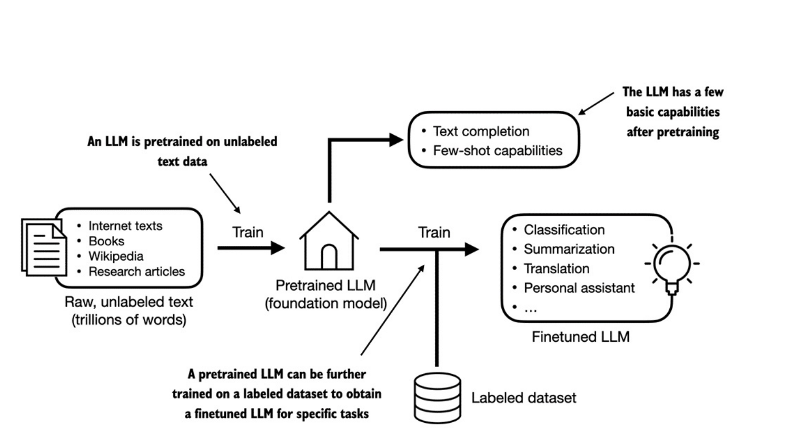
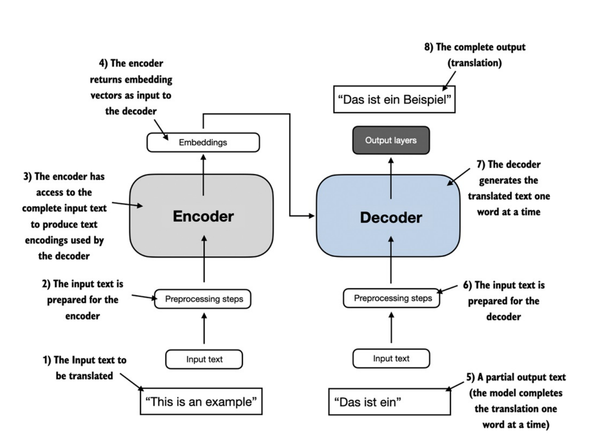
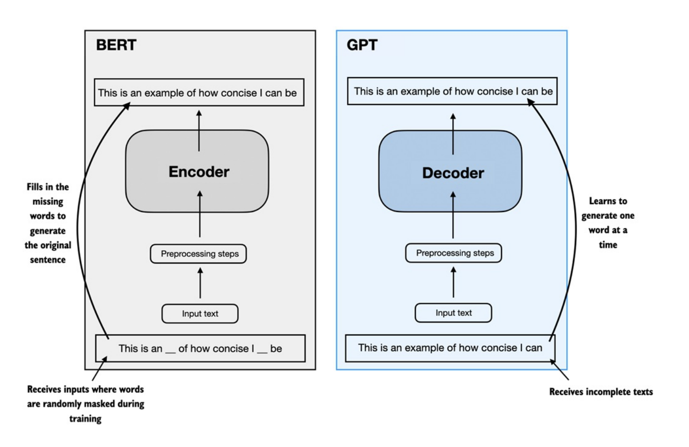
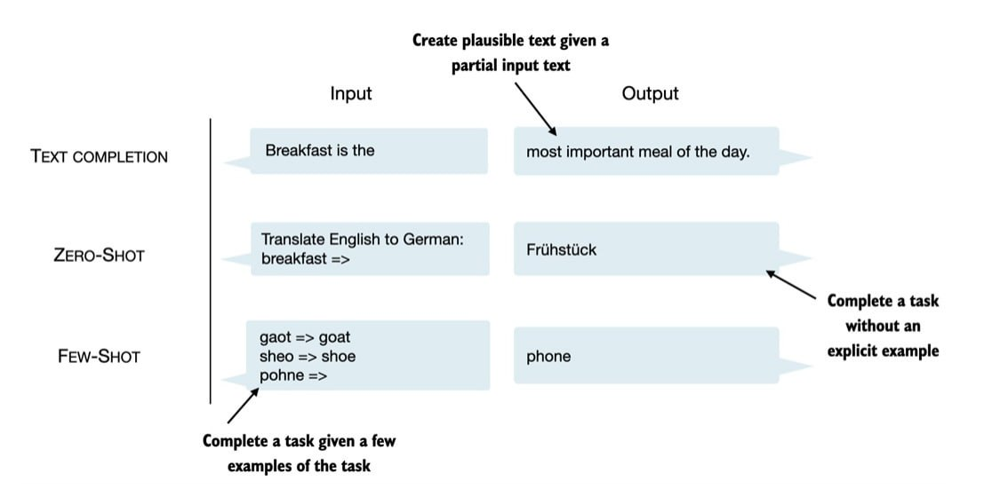

## Introduction Pipelines

- Bước đầu tiên để xây dựng 1 LLM là huấn luyện trên một tập văn bản khổng lồ (raw text). Tập này là văn bản thông thường, không có thông tin nhãn.

- Giai đoạn huấn luyện đầu tiên này còn được gọi là `pretraining`, tạo ra một mô hình LLM sơ cấp (pretrained LLM), thường được gọi là `base model` hoặc `foundation model`. Mô hình này có khả năng hoàn thành văn bản (`text completion`), tức là hoàn tất một câu dở dang do người dùng nhập vào. Nó cũng có khả năng `few-shot learning` ở mức hạn chế, nghĩa là có thể học cách thực hiện một nhiệm vụ mới chỉ dựa vào một vài ví dụ, thay vì cần một lượng dữ liệu huấn luyện lớn.

- Sau khi có một mô hình đã được `pretrain` (từ việc huấn luyện trên tập dữ liệu văn bản lớn, trong đó LLM học cách dự đoán từ tiếp theo trong chuỗi văn bản), chúng ta có thể huấn luyện tiếp trên dữ liệu có nhãn, còn được gọi là `finetuning`.

- Có 2 hướng `finetuning` phổ biến:
    + `Instruction-finetuning`: Chatbot, Translator, Q&A…
    + `Classification tasks finetuning`: Spam detection, sentiment analysis, intent detection

## Original Transformers Architecture

### 1. Encoder & Decoder

- Kiến trúc `transformers` gồm 2 module là `Encoder` & `Decoder`.

#### Token -> Embedding
    + “The” → [0.2, 0.7, -0.1, …]
    + “cat” → [0.5, 0.1, 0.8, …]
    + “sat” → [0.9, -0.3, 0.4, …]

#### Encoder
- Các embedding được đưa qua nhiều layer `self-attention` + `feed-forward` để nắm bắt đặc trưng của các token xung quanh.
- Từ đó, ở output của Encoder, mỗi token có 1 `contextual embedding` (embedding giàu ngữ cảnh).

#### Decoder
- `Masked self-attention`: Decoder tự nhìn vào các token đã sinh trước đó để dự đoán token kế tiếp.

- `Cross-attention`: Decoder nhìn vào toàn bộ embedding của Encoder để quyết định thông tin nào cần dùng khi sinh token tiếp theo.

- `Feed-forward (FNN)`: đưa qua 1 mạng MLP để học được đặc trưng phi tuyến.

#### Example
- 🏋️`TRAINING`:

    + Input: `"This is an example"`
    + Target: `"Das ist ein Beispiel"`

    + Cách mô hình học:
        + 1. Encoder nhận `"This is an example"` $\rightarrow$ sinh embedding vectors.
        + 2. Decoder nhận `Target` nhưng `dịch lệch phải (shifted right)`
            - Input cho Decoder: `"<BOS> Das ist ein"` (trong đó `<BOS> = Begin Of Sentence)`.
            - Output cần dự đoán: `"Das ist ein Beispiel <EOS>"`.
        + 3. Nhờ đó, mô hình học được cách dự đoán token tiếp theo:
            - Khi input `<BOS>`, output phải là `"Das"`.
            - Khi input `"Das"`, output phải là `"ist"`.
            - Khi input `"Das ist ein"`, output phải là `"Beispiel"`.
    - Đây còn gọi là `teacher forcing`.

- 🤖`INFERENCE`:
    
    + 1. Khi Encoder nhận `"This is an example"`.
    + 2. Decoder khởi đầu chỉ có `<BOS>`. Sau đó dự đoán từ đầu tiên: `"Das"`.
    + 3. Lấy `"Das"` làm input tiếp theo cho Decoder. Dự đoán từ thứ 2: `"ist"`.
    + 4. Input cho Decoder lúc này: `"Das ist"`. Dự đoán từ tiếp: `"ein"`.
    + 5. Input `"Das ist ein"`, dự đoán `"Beispiel"`.

    + Mô hình cứ thế `tự sinh → nạp lại → sinh tiếp` cho đến khi gặp token đặc biệt `<EOS>` (End Of Sentence).

### 2. BERT & GPT

- *BERT (Bidirectional Encoder Representations from Transformers)*:

    + Được xây dựng từ kiến trúc Encoder của Transformer gốc. BERT không dùng để sinh văn bản mà tập trung vào `Masked Language Modeling (MLM)` - che giấu một số từ trong câu rồi yêu cầu mô hình dự đoán lại.

- *GPT (Generative Pretrained Transformers)*:

    + Ngược lại, GPT dựa trên Decoder của Transformer, được sử dụng cho tác vụ sinh văn bản: *dịch máy, tóm tắt, viết code, ...*

    + Ngoài *text completion*, các mô hình LLM giống GPT có thể giải quyết nhiều task khác nhau mà không cần retraining hay finetuning. Trong vài trường hợp, việc thiết lập output mong muốn trong phần input được gọi là `few-shot`. Ngoài ra, GPT cũng có khả năng thực hiện task ngay cả khi không cần ví dụ cụ thể, còn gọi là `zero-shot`.
    

## Summary
- Các mô hình ngôn ngữ lớn (LLM) được huấn luyện theo 2 bước chính. Trước tiên, chúng được pretrained trên một kho văn bản khổng lồ không gắn nhãn bằng cách dự đoán từ tiếp theo trong một câu như là "nhãn". Sau đó, chúng được finetuned trên một tập nhỏ hơn, có gắn nhãn để làm theo instruction hoặc thực hiện tác vụ classification.

- LLM dựa trên kiến trúc Transformer. Key idea của Transformer là cơ chế `attention`, cho phép LLM có thể "nhìn" được toàn bộ chuỗi đầu vào trước khi tạo ra từng từ.

- Kiến trúc Transformer bao gồm 1 bộ mã hóa (Encoder) để phân tích văn bản & 1 bộ giải mã (Decoder) để sinh văn bản.

- Các LLM như GPT-3 & ChatGPT chỉ triển khai các module Decoder.

- Nhiệm vụ của quá trình pretrained LLM là dự đoán từ tiếp theo, nhưng LLM lại thể hiện các tính chất nổi lên như classification, translation hay summarize texts.