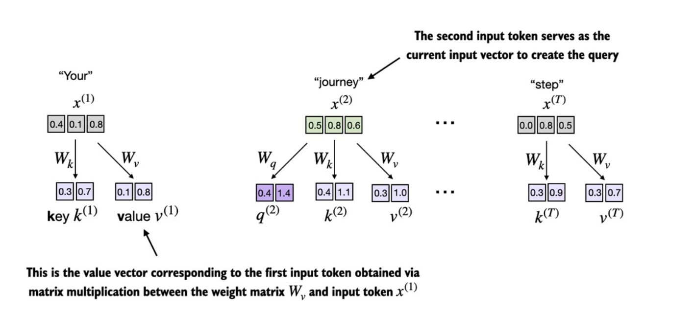
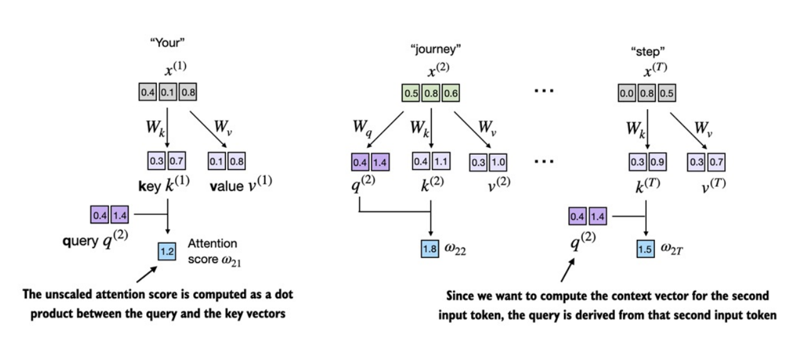
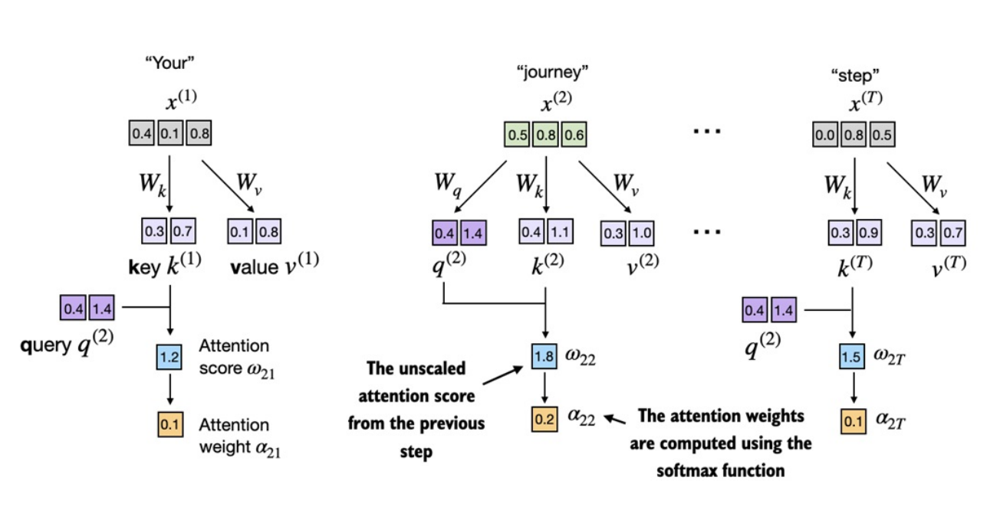
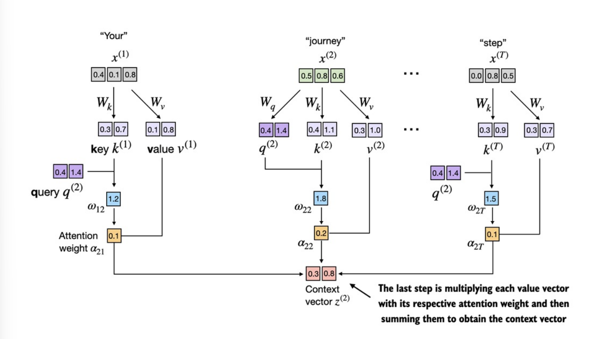
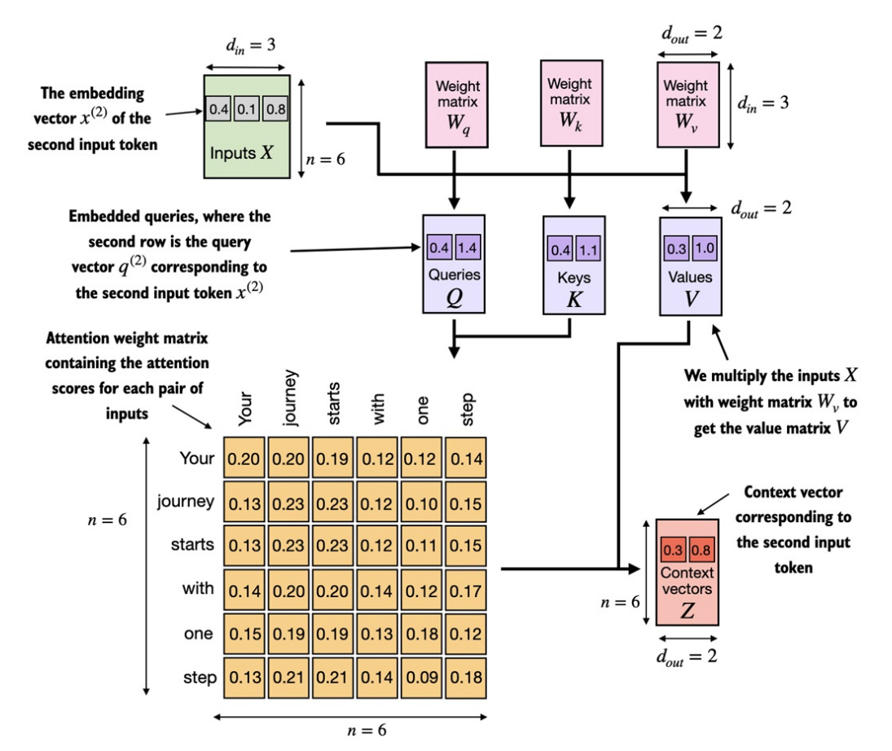

## 3.4. Cơ chế self-attention đơn giản có trainable weights
- Điểm khác biệt quan trọng nhất ở phần này so với phần trước là việc `các trainable weights matrices` sẽ _được cập nhật trong quá trình huấn luyện._

- Ta sẽ triển khai qua 2 bước:
    + __Bước 1:__ Viết code chi tiết từng bước (giống phần _no weights_)

    + __Bước 2:__ Gom thành 1 class Python để import vào LLM architecture (sẽ triển khai ở các phần sau)

### _Từng bước tính trainable weights_
- Theo dõi code minh họa tại [`7. Self-attention-trainable.ipynb`](https://github.com/tyanfarm/build-LLM-from-scratch-notebook/blob/main/7.%20Self-attention-trainable.ipynb).

- Trước tiên ở phần này sẽ có thêm `3 weights matrices` có thể huấn luyện được: $$ W_q, W_k, W_v $$

- Ba ma trận này dùng để `chiếu` các `token đầu vào` đã được `embedding` $x^{(i)}$ sang 3 loại vector khác nhau: `query (q)`, `key (k)`, `value (v)`.

- 
    + Ở ảnh trên, `input token thứ 2` $x^{(2)}$ được chọn làm `query input`.

    + Vector _query_ $q^{(2)}$ được tính bằng _nhân ma trận_ giữa $x^{(2)}$ và weights matrix $W_q$: $$ q^{(2)} = x^{(2)} W_q $$ 

    + Tương tự với _key_ $k^{(2)}$ và _value_ $v^{(2)}$: $$ k^{(2)} = x^{(2)} W_k, v^{(2)} = x^{(2)} W_v $$ 

- Lý do tách ra 3 loại vector:
    + __Query (q)__: vector dùng để đi xét với các vector khác.

    + __Key (k)__: vector dùng để xét khi các vector khác tìm tới mình.     

    + __Value (v)__: vector chứa các đặc trưng về ngữ nghĩa.

- 
    + Vì đang tính `context vector` cho `token 2` nên `attention scores` được tính bằng $q^{(2)}$ với các $k^{(i)}$.    

- `attention scores` $\omega$ được tính bằng [`dot product`](./bonus-section/vector-matrix-products.md) tương tự cơ chế `self-attention đơn giản` ở phần trước. Điểm khác là ở đây được tính giữa vector `query` và vector `key`, với `query` là vector biểu diễn `token` đang xét và `key` là các vector biểu diễn các `token` sẽ được "so sánh" với _query_.

- 

- Ta sẽ tiến hành tính toán `attention weights` bằng cách điều chỉnh `attention scores` với hàm `softmax` đã thực nghiệm ở phần trước. 

- Điểm khác so với phần trước là ta sẽ chuẩn hóa `attention scores` bằng cách `chia cho căn bậc hai của embedding dimension` của `keys`: 
    $$ \alpha_{2i} = \frac{\omega_{2i}}{\sqrt{d_k}} $$

    + với $d_k$ là _embedding dimension keys_.

- Lý do cho việc `scaled dot-product attention` này là ` cải thiện quá trình training` bằng cách `tránh gradient nhỏ`. Ví dụ:
    + Giả sử _dot-product_ là _[28, 23, 21, 12, 6, 19]_ và _embedding dim_ $d_k$ = 1024
    
    + __Không scale__: softmax gần như _[≈ 1, 0, 0, 0, 0, 0]_.

    + __Scale với__ $\sqrt{1024}$: softmax thành _[0.2211, 0.1891, 0.1776, 0.1341, 0.1112, 0.1669]_. $\rightarrow$ Gradient lan truyền tốt hơn.

- 

- Bước cuối cùng là tính `context vector` như hình ở trên. Tương tự như ở phần trước nhưng thay vì được tạo bằng tổng các `input vector` nhân với `attention weight` tương ứng thì ở đây sẽ là tổng các `value (v) vector` nhân với `attention weight` tương ứng: $$ z^{(2)} = \sum_{j=1}^{T} \alpha_{2j} ⋅ v^{(j)} $$

#### _Tại sao lại là query, key & value?_
- 3 khái niệm này được _mượn_ từ _information retrieval & databases_, nơi dữ liệu được lưu trữ, tìm kiếm & truy xuất.

- __Query (q)__: dùng để biểu diễn phần tử hiện tại mà mô hình đang muốn hiểu rõ hơn, dùng để so sánh với các phần tử khác xem cần chú ý đến phần tử nào. 

- __Key (k)__: dùng để so khớp (match) với query, mỗi phần tử đầu vào đều có 1 key tương ứng.

- __Value (v)__: Tương tự như _key-value_ trong databases. Sau khi mô hình xác định được các _key_ nào liên quan tới _query_, nó sẽ lấy ra các _value_ tương ứng. 

### _Triển khai Python class cho self-attention_
- Theo dõi code minh họa tại [`8. Self-attention-class.ipynb`](https://github.com/tyanfarm/build-LLM-from-scratch-notebook/blob/main/8.%20Self-attention-class.ipynb).

- 
    + Trong `self-attention`, ta biến đổi `input vector` $X$ thông qua 3 ma trận trọng số: $W_q$, $W_k$, $W_v$. 
    
    + Sau đó, tính `attention scores` dựa trên các vector $Q$ & vector $K$ thu được.

    + `attention scores` được chuẩn hóa qua hàm `softmax` để trả về `attention weights`.

    + Nhân `attention weights` với các vector $V$ tương ứng để ra được các `context vector` $Z$.

- Ta có thể cải thiện version `SelfAttention_v1` bằng cách sử dụng các tầng `nn.Linear` của Pytorch. Bản chất của lớp __Linear__ này là thực hiện phép tính $y = xW + b$.
Nếu ta tắt bias (tức là $b=0$), thì nó chính xác là $y = xW$.

- `nn.Linear` khởi tạo _weights_ tiên tiến hơn (ví dụ _Xavier initialization_ hoặc _Kaiming initialization_), giúp mô hình học ổn định và tránh gradient quá lớn/nhỏ.

- Ngoài ra, `nn.Linear` có cơ chế tự khởi tạo trọng số $W$ được tối ưu sẵn, thay vì dùng `torch.rand()`.

- Triển khai version `SelfAttention_v2` tại [`8. Self-attention-class.ipynb`](https://github.com/tyanfarm/build-LLM-from-scratch-notebook/blob/main/8.%20Self-attention-class.ipynb).
