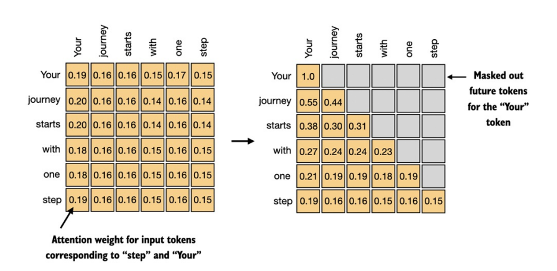
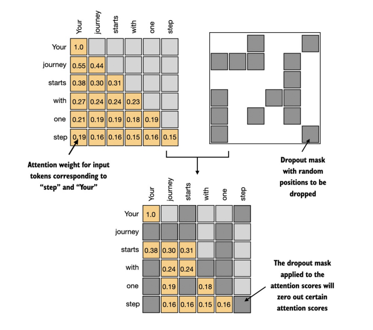

## 3.5. Che đi (mask) các từ phía sau với cơ chế causal attention
- Ở phần này, ta sẽ biến đổi cơ chế `self-attention` tiêu chuẩn để tạo ra cơ chế `causal attention` - một thành phần cốt lõi của Transformer.

- _Causal attention_, còn gọi là _masked attention_, là một dạng chuyên biệt của _self-attention_. Cơ chế này giới hạn mô hình chỉ được "nhìn thấy" _các token đầu vào trước đó và hiện tại_ khi xử lí bất kì token nào. Điều này trái ngược với cơ chế _self-attention_ tiêu chuẩn, vốn cho phép "nhìn thấy" toàn bộ chuỗi _các token đầu vào_.

- Do đó, khi tính toán `attention scores`, _causal attention_ đảm bảo mô hình chỉ tính đến các token xuất hiện `tại hoặc trước` token hiện tại trong chuỗi. 

- Ở hình phía dưới, cơ chế `causal attention` che (mask) các _attention weights_ ở _phía trên đường chéo chính_. Điều này đảm bảo với 1 đầu vào đã cho, LLM không thể lấy các token tương lai khi tính toán các `context vectors`. 
- 

- Theo dõi code minh họa tại - Theo dõi code minh họa tại [`9. Causal-attention.ipynb`](https://github.com/tyanfarm/build-LLM-from-scratch-notebook/blob/main/9.%20Causal-attention.ipynb).

    + Version 01:
    + 

    + Version 02:
    + 

#### Mask thêm các attention weights với dropout
- Nếu `casual mask` là để ngăn mô hình ăn gian trong quá trình học khi "nhìn" các _future token_, thì `dropout` là để tránh mô hình _overfitting_ vào một tập đơn vị nào đó trong hidden layer. Lưu ý rằng _dropout_ chỉ được sử dụng trong quá trình _training_.

- $\rightarrow$ Mục tiêu: `Chống overfitting`

- 

- Được minh họa ở hình trên, sau khi sử dụng `causal mask`, ta thêm 1 `dropout mask` để gán _giá trị 0_ một cách ngẫu nhiên nhằm giảm _overfitting_ trong quá trình _training_.

- 

- Ở phần này ta đã tìm hiểu về cơ chế hoạt động và triển khai code của `causal attention`. Ở phần sau ta sẽ mở rộng thêm và triển khai cơ chế `multi-head attention` để triển khai _cơ chế causal attention_ song song.

