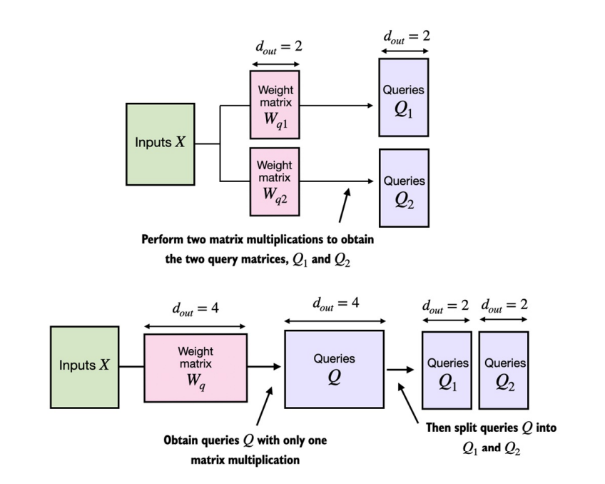

## 3.6. Cải tiến từ single-head attention sang multi-head attention

- Ở phần này ta sẽ mở rộng `multi-head attention` từ `causal attention`. 

- Triển khai đầu tiên sẽ xây dựng module _multi-head attention_ bằng cách _xếp chồng_ nhiều module `CausalAttention` để dễ hình dung.

- Sau đó triển khai tiếp theo sẽ xây dựng cùng 1 module _multi-head attention_ đó theo một cách phức tạp hơn để mang lại hiệu suất tính toán cao hơn.

### _Xếp chồng nhiều lớp single-head attention_
- Khi triển khai _multi-head attention_, ta cần tạo ra nhiều `instances` của _self-attention_. Mỗi _instance_ này sẽ có bộ _weights_ riêng biệt, sau đó kết quả đầu ra sẽ được kết hợp với nhau. Việc sử dụng nhiều _instances_ có thể tốn tài nguyên tính toán, nhưng là _yếu tố then chốt_ cho khả năng nhận diện các đặc trưng phức tạp - đặc điểm nổi bật của LLM dựa trên Transformer.

- 

- Module _multi-head attention_ trên mô tả 2 module _single-head attention_ xếp chồng lên nhau. Thay vì sử dụng 1 ma trận duy nhất $W_v$ để tính _ma trận vector values_, giờ ta có 2 ma trận weights $W_{v1}$ & $W_{v2}$, tương tự với $W_q$ & $W_k$. Kết quả ta thu được 2 bộ _context vector_ $Z_1$ & $Z_2$, sau đó kết hợp thành 1 bộ $Z$ duy nhất.

- Code triển khai xem tại [`10. Multi-head-attention.ipynb`](https://github.com/tyanfarm/build-LLM-from-scratch-notebook/blob/main/10.%20Multi-head-attention.ipynb).

- 

- Trong `MultiHeadAttentionWrapper` triển khai ở code trên, nếu có 2 _attention heads_ và _embedding_dim_ = 2, thì đầu ra sẽ là 1 _context vector_ có dim_out = 2 x 2 = 4.

### _Chia nhỏ weights_
- Thay vì duy trì 2 lớp _CausalAttention_ riêng biệt như phần trước, ta có thể kết hợp chúng lại vào lớp `MultiHeadAttention`. 

- 

- Như _implement class_ trước thì ta thiết lập cơ chế _multi-head_ bằng cách gộp lại các lớp _CausalAttention_. Còn ở phần _chia nhỏ weights_ này ta sẽ xử lí với các _tensor_ có số chiều lớn hơn, sau đó chia nhỏ cho từng _head_ để trích xuất các đặc trưng riêng biệt.

- Theo dõi code triển khai tại [`10. Multi-head-attention.ipynb`](https://github.com/tyanfarm/build-LLM-from-scratch-notebook/blob/main/10.%20Multi-head-attention.ipynb).