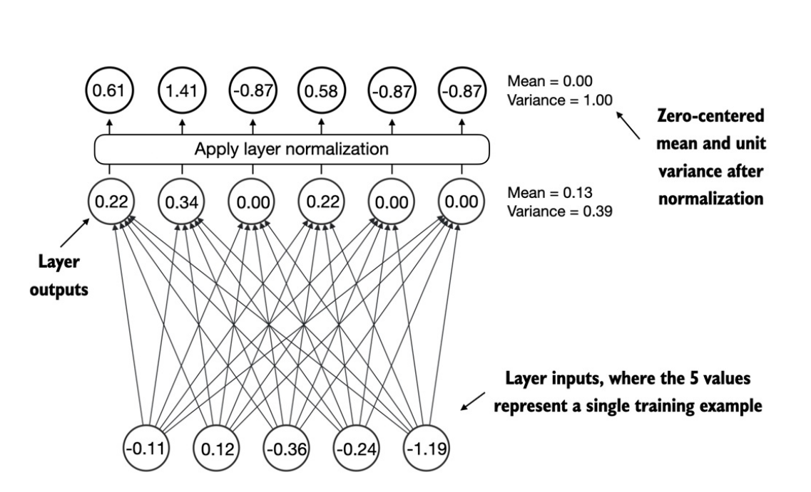
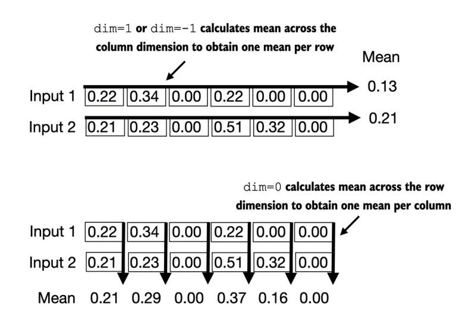
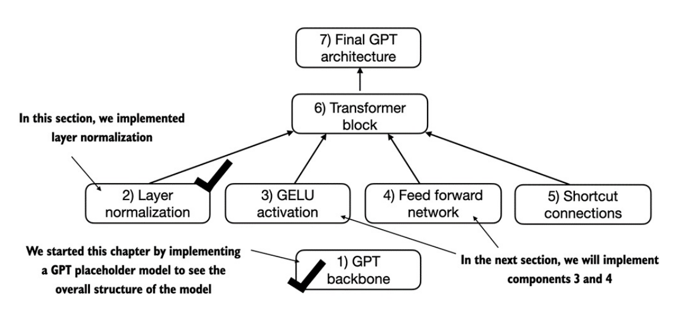

## 4.1. Code LLM architecture

### GPT Backbone
- Các mô hình Ngôn ngữ lớn (LLM) như GPT (Generative Pretrained Transformer) là những kiến trúc mạng nơ-ron có kích thước khổng lồ. 

- Tuy nhiên, kiến trúc của mô hình này thực chất lại ít phức tạp hơn bạn tưởng, bởi nhiều thành phần bên trong được lặp đi lặp lại (chúng ta sẽ tìm hiểu sau).

- 

- Phía trên là hình mô tả tổng quát về _1 mô hình GPT_. Bên cạnh các `embedding layers` & `inputs tokenization`, nó bao gồm _1 hoặc nhiều_ khối `Transformer` chứa module `masked multi-head attention` (đã triển khai ở chương trước). 

- Trọng tâm ở chương này sẽ triển khai _core_ của LLM, bao gồm các _khối transformer_, sau đó chúng ta sẽ _huấn luyện_ ở chương tiếp theo để tạo ra văn bản giống con người.

- Dưới đây là mô tả các bước để build 1 mô hình GPT hoàn chỉnh.
- 

- Bắt đầu với bước đầu tiên là xây dựng `GPT Backbone`, ta sẽ triển khai 1 class là `DummyGPTModel` - phiên bản đơn giản hóa của mô hình GPT, sử dụng module neural network của Pytorch _nn.Module_. Kiến trúc của mô hình được triển khai tại phần `1. GPT Backbone` trong [`11. Placeholder-GPT.ipynb`](https://github.com/tyanfarm/build-LLM-from-scratch-notebook/blob/main/11.%20Placeholder-GPT.ipynb). 

### Layer Normalization
- Việc huấn luyện `deep neural network` (mạng nơ-ron sâu) với nhiều tầng `hidden layer` dễ gặp vấn đề như _vanishing gradient (triệt tiêu đạo hàm)_ hay _exploding gradient (bùng nổ đạo hàm)_. Điều này có nghĩa mô hình sẽ gặp khó khăn trong việc tìm ra bộ tham số tối ưu để giảm _loss_.

- Phần này chúng ta sẽ triển khai `layer normalization`. Ý tưởng chính là điều chỉnh các giá trị kích hoạt (`activations`) đầu ra của 1 _hidden layer_ sao cho chúng có _giá trị trung bình ([mean](../machine-learning/base-math/probability-statistics.md#trung-bình-cộng-mean))_ bằng 0 và _phương sai ([variance](../machine-learning/base-math/probability-statistics.md#phương-sai-variance))_ bằng 1 - việc điều chỉnh _mean_ & _variance_ này là của [Standardization](./bonus-section/normalization.md#standardization-z-score-normalization). Để ý thêm 1 điều là tại sao lại chuẩn hóa theo 2 giá trị này, thì bởi vì [Phân phối chuẩn](../machine-learning/base-math/probability-statistics.md#phân-phối-chuẩn-gaussiannormal-distribution) dựa trên 2 tham số này.

- Trong _GPT-2_ và các kiến trúc _Transformer_ hiện đại, _Layer Normalization_ thường được áp dụng _trước và sau_ khối _multi-head attention_ và trước _output layer_.

    ##### Hàm kích hoạt (Activations)
    - Khi đi qua các tầng _Linear_ thì mô hình chỉ học được các mối quan hệ tuyến tính.
    - Hàm kích hoạt lúc này giúp mô hình học thêm các mối quan hệ phi tuyến tính. Ví dụ hàm _ReLU_ chuyển các giá trị âm về 0.

- Trước khi đi vào phần triển khai code ta hãy xem qua sơ đồ tổng quan của _layer normalization_:

- 

- Ở hình trên, khi đi qua tầng _hidden layer_ thì các giá trị đầu ra sẽ được tính toán để đưa về trạng thái có _mean bằng 0 & variance bằng 1_. Quá trình này giúp ổn định dòng dữ liệu và tăng tốc độ hội tụ mô hình.

- Code được triển khai tại phần `2. Layer Normalization` trong [`11. Placeholder-GPT.ipynb`](https://github.com/tyanfarm/build-LLM-from-scratch-notebook/blob/main/11.%20Placeholder-GPT.ipynb). 

    ##### Chiều (dimension) khi tính _mean_
    - 

    - Trên đây là mô tả về chiều tính toán _mean_ trên 1 tensor 2D _[rows, columns]_.

    - Việc sử dụng `dim=-1` giúp tính _mean_ trên chiều cuối cùng của tensor. Sau này, khi thêm _chuẩn hóa lớp (layer normalization)_ - nơi tạo ra tensor 3D _[batch_size, num_tokens, embedding_dim]_ thì việc giữ nguyên _dim=-1_ linh hoạt hơn nhiều so với phải thay đổi thủ công từ _dim=1_ sang _dim=2_.

- 

- Phần sau ta sẽ tìm hiểu về _hàm kích hoạt_ `GeLU` - một trong các hàm kích hoạt dùng trong LLMs, thay cho hàm truyền thống _ReLU_.

### GeLU Activations

### Feed Forward Network