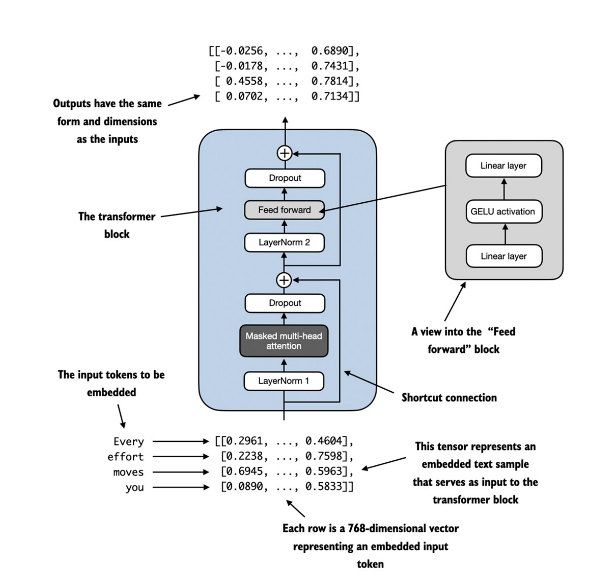

## 4.1. Code LLM architecture

### GPT Backbone
- Các mô hình Ngôn ngữ lớn (LLM) như GPT (Generative Pretrained Transformer) là những kiến trúc mạng nơ-ron có kích thước khổng lồ. 

- Tuy nhiên, kiến trúc của mô hình này thực chất lại ít phức tạp hơn bạn tưởng, bởi nhiều thành phần bên trong được lặp đi lặp lại (chúng ta sẽ tìm hiểu sau).

- 

- Phía trên là hình mô tả tổng quát về _1 mô hình GPT_. Bên cạnh các `embedding layers` & `inputs tokenization`, nó bao gồm _1 hoặc nhiều_ khối `Transformer` chứa module `masked multi-head attention` (đã triển khai ở chương trước). 

- Trọng tâm ở chương này sẽ triển khai _core_ của LLM, bao gồm các _khối transformer_, sau đó chúng ta sẽ _huấn luyện_ ở chương tiếp theo để tạo ra văn bản giống con người.

- Dưới đây là mô tả các bước để build 1 mô hình GPT hoàn chỉnh.
- 

- Bắt đầu với bước đầu tiên là xây dựng `GPT Backbone`, ta sẽ triển khai 1 class là `DummyGPTModel` - phiên bản đơn giản hóa của mô hình GPT, sử dụng module neural network của Pytorch _nn.Module_. Kiến trúc của mô hình được triển khai tại phần `1. GPT Backbone` trong [`11. Placeholder-GPT.ipynb`](https://github.com/tyanfarm/build-LLM-from-scratch-notebook/blob/main/11.%20Placeholder-GPT.ipynb). 

### Layer Normalization
- Việc huấn luyện `deep neural network` (mạng nơ-ron sâu) với nhiều tầng `hidden layer` dễ gặp vấn đề như _vanishing gradient (triệt tiêu đạo hàm)_ hay _exploding gradient (bùng nổ đạo hàm)_. Điều này có nghĩa mô hình sẽ gặp khó khăn trong việc tìm ra bộ tham số tối ưu để giảm _loss_.

- Phần này chúng ta sẽ triển khai `layer normalization`. Ý tưởng chính là điều chỉnh các giá trị kích hoạt (`activations`) đầu ra của 1 _hidden layer_ sao cho chúng có _giá trị trung bình ([mean](../machine-learning/base-math/probability-statistics.md#trung-bình-cộng-mean))_ bằng 0 và _phương sai ([variance](../machine-learning/base-math/probability-statistics.md#phương-sai-variance))_ bằng 1 - việc điều chỉnh _mean_ & _variance_ này là của [Standardization](./bonus-section/normalization.md#standardization-z-score-normalization). Để ý thêm 1 điều là tại sao lại chuẩn hóa theo 2 giá trị này, thì bởi vì [Phân phối chuẩn](../machine-learning/base-math/probability-statistics.md#phân-phối-chuẩn-gaussiannormal-distribution) dựa trên 2 tham số này.

    ##### Tại sao lại cần Standardization Z-score?
    - Khi dữ liệu truyền qua từng lớp, nếu _giá trị kích hoạt_ thay đổi _quá lớn_ hoặc _quá nhỏ_, thì khi _backprobagation_ sẽ bị _bùng nổ_ hoặc _triệt tiêu_ _đạo hàm_. Do đó, `LayerNorm` sử dụng _z-score_ để chuẩn hóa dữ liệu đưa về thang đo chung ở mỗi bước.

- Trong _GPT-2_ và các kiến trúc _Transformer_ hiện đại, _Layer Normalization_ thường được áp dụng _trước và sau_ khối _multi-head attention_ và trước _output layer_.

    ##### Hàm kích hoạt (Activations)
    - Khi đi qua các tầng _Linear_ thì mô hình chỉ học được các mối quan hệ tuyến tính.
    - Hàm kích hoạt lúc này giúp mô hình học thêm các mối quan hệ phi tuyến tính. Ví dụ hàm _ReLU_ chuyển các giá trị âm về 0.

- Trước khi đi vào phần triển khai code ta hãy xem qua sơ đồ tổng quan của _layer normalization_:

- 

- Ở hình trên, khi đi qua tầng _hidden layer_ thì các giá trị đầu ra sẽ được tính toán để đưa về trạng thái có _mean bằng 0 & variance bằng 1_. Quá trình này giúp ổn định dòng dữ liệu và tăng tốc độ hội tụ mô hình.

- Code được triển khai tại phần `2. Layer Normalization` trong [`11. Placeholder-GPT.ipynb`](https://github.com/tyanfarm/build-LLM-from-scratch-notebook/blob/main/11.%20Placeholder-GPT.ipynb). 

    ##### Chiều (dimension) khi tính _mean_
    - 

    - Trên đây là mô tả về chiều tính toán _mean_ trên 1 tensor 2D _[rows, columns]_.

    - Việc sử dụng `dim=-1` giúp tính _mean_ trên chiều cuối cùng của tensor. Sau này, khi thêm _chuẩn hóa lớp (layer normalization)_ - nơi tạo ra tensor 3D _[batch_size, num_tokens, embedding_dim]_ thì việc giữ nguyên _dim=-1_ linh hoạt hơn nhiều so với phải thay đổi thủ công từ _dim=1_ sang _dim=2_.

- 

- Phần sau ta sẽ tìm hiểu về _hàm kích hoạt_ `GeLU` - một trong các hàm kích hoạt dùng trong LLMs, thay cho hàm truyền thống _ReLU_.

### GeLU Activations
- Trước đây, hàm kích hoạt `ReLU` đã được sử dụng phổ biến trong học sâu nhờ tính đơn giản và hiệu quả trên nhiều kiến trúc mạng nơ-ron khác nhau. Tuy nhiên, trong các mô hình ngôn ngữ lớn (LLM), người ta thường sử dụng các hàm kích hoạt khác thay thế cho ReLU truyền thống. Hai ví dụ tiêu biểu là `GeLU` _(Gaussian Error Linear Unit)_ và `SwiGLU`_(Sigmoid-Weighted Linear Unit)_, lần lượt tích hợp các _đơn vị tuyến tính_ kiểm soát bởi _phân phối_ `Gaussian` & `Sigmoid`.

- _Hàm kích hoạt GeLU_ có thể được triển khai theo nhiều cách khác nhau. Phiên bản chính xác được xác định là $GELU(x) = x \Phi(x)$, với $\Phi(x)$ là `hàm phân phối tích lũy` của [Phân phối Gaussian chuẩn](../machine-learning/base-math/probability-statistics.md#phân-phối-chuẩn-gaussiannormal-distribution). 

- Tuy nhiên trong thực tế người ta thường triển khai 1 bản xấp xỉ có chi phí tính toán thấp hơn (GPT-2 gốc cũng sử dụng):

$$GELU(x) \approx 0.5 \cdot x \cdot (1 + \tanh[\sqrt{2/\pi} \cdot (x + 0.044715 \cdot x^3)])$$

- Code được triển khai tại phần `3. GeLU Activations` trong [`11. Placeholder-GPT.ipynb`](https://github.com/tyanfarm/build-LLM-from-scratch-notebook/blob/main/11.%20Placeholder-GPT.ipynb). 

### Feed Forward Network
- Lớp `FeedForward (FNN)` là 1 mạng nơ-ron nhỏ gồm _2 phép biến đổi tuyến tính_ và _1 hàm kích hoạt phi tuyến_ (ở phần này ta sẽ dùng _GeLU_):

    + _Mở rộng không gian_: FNN đưa các vector đầu vào từ không gian _embedding-dim_ lên không gian có số chiều lớn hơn (ở phần này là _gấp 4 lần_).

    + Sau đó các vector sẽ được đưa qua _1 hàm kích hoạt_ để học được các đặc trưng phi tuyến và loại bỏ các đặc trưng nhiễu.

    + Cuối cùng, các vector được chiếu ngược lại về không gian ban đầu để đi tiếp vào các layers sau.

- 

- Code được triển khai tại phần `4. Feed Forward Network` trong [`11. Placeholder-GPT.ipynb`](https://github.com/tyanfarm/build-LLM-from-scratch-notebook/blob/main/11.%20Placeholder-GPT.ipynb). 

### Shortcut Connections
- _Shortcut Connections_, hay còn gọi là _skip hoặc residual connections_ ban đầu được đề xuất trong các mạng nơ-ron sâu trong lĩnh vực CV (Computer Vision) cụ thể là các mạng _Residual - ResNet_ nhằm giảm thiểu thách thức về `Vanishing Gradient` (triệt tiêu đạo hàm).

    + 

    + _Vanishing Gradient_ là hiện tượng khi mạng quá sâu, các đạo hàm (_gradient_) phải nhân với nhau nhiều lần khi truyền ngược từ cuối về đầu ([Backpropagation](./appendix.md#đạo-hàm--gradients)). Nếu các giá trị này _nhỏ hơn 1_ chúng sẽ càng nhân càng nhỏ.

- 

- Ở hình trên là 2 mạng nơ-ron sâu gồm 5 lớp _có shortcut connections_ (bên phải) & _không có shortcut connections_ (bên trái). Có thể thấy ở bên trái khi về _Layer 1_ thì _gradient_ nó đã về rất bé.

- Để dễ hiểu thì `shortcut connections` là _cộng đầu ra của 1 lớp với giá trị đầu vào trước khi qua lớp đó_, triển khai qua công thức sau đây: $$ y = f(x) + x $$

    + $x$: là dữ liệu đầu vào trước khi đi qua lớp nơ-ron.

    + $y = f(x)$: đầu ra của 1 lớp Linear.

- _Tại sao lại là công thức này?_ 

    + Vì khi đi qua đạo hàm thì công thức này sẽ thành: $$ \frac{\partial y}{\partial x} = \frac{\partial (f(x) + x)}{\partial x} = f'(x) + 1 $$

    + _Khi áp dụng vào backprobagation_ để tính Gradient truyền về: $$ \frac{\partial Loss}{\partial x} = \frac{\partial Loss}{\partial y} \cdot (f'(x) + \mathbf{1}) = \underline{\frac{\partial Loss}{\partial y} \cdot f'(x)} + \underline{\frac{\partial Loss}{\partial y}} $$

    + Nếu $f'(x)$ có giảm nhỏ bao nhiêu thì $\frac{\partial Loss}{\partial y}$ vẫn giúp _gradient được truyền ngược về đầu_ mà không bị _triệt tiêu_.

- Code được triển khai tại phần `5. Shortcut Connection` trong [`11. Placeholder-GPT.ipynb`](https://github.com/tyanfarm/build-LLM-from-scratch-notebook/blob/main/11.%20Placeholder-GPT.ipynb). 

### Transformer Block
- Phần này chúng ta sẽ triển khai đầy đủ các thành phần của 1 khối _Transformer_ hoàn chỉnh. Khối này được lặp lại hàng chục lần trong kiến trúc _GPT-2 124M tham số_, kết hợp với nhiều khái niệm chúng ta đã tìm hiểu trước đó: `multi-head attention`, `layer normalization`, `dropout`, `feed-forward layer` & `GeLU activations`. Phần sau ta sẽ kết nối _khối Transformer_ với các phần còn lại của _kiến trúc GPT_.

- 

- Ý tưởng cốt lõi là _cơ chế self-attention_ trong khối _multi-head_ sẽ xác định và phân tích các mối quan hệ giữa từng token đầu vào. Ngược lại, _mạng feed-forward_ sẽ sửa lỗi độc lập từng vị trí.

- Code được triển khai tại phần `6. Transformer Block` trong [`11. Placeholder-GPT.ipynb`](https://github.com/tyanfarm/build-LLM-from-scratch-notebook/blob/main/11.%20Placeholder-GPT.ipynb). 

- _LayerNorm_ được áp dụng trước _MultiHeadAttention_ & mạng _FeedForward_, và _Dropout_ được áp dụng sau để điều tiết mô hình và ngăn chặn _overfitting_. Cấu trúc này được gọi là `Pre-LayerNorm`, các kiến trúc cũ hơn như Transformer nguyên bản áp dụng _chuẩn hóa_ sau mạng self-attention & feed-forward, được gọi là `Post-LayerNorm` - thường dẫn đến động lực huấn luyện (_training dynamics_) kém hơn.

- Việc kích thước vector được giữ nguyên khi đi qua _khối Transformer_ là thiết kế cho phép ứng dụng hiệu quả trên phạm vi rộng các tác vụ chuỗi sang chuỗi _(Sequence-to-Sequence)_, nơi mỗi vector đầu ra tương ứng trực tiếp với vector đầu vào, duy trì quan hệ 1-1, đồng thời tích hợp thông tin ngữ cảnh từ khắp toàn bộ chuỗi input ban đầu.

### GPT model
