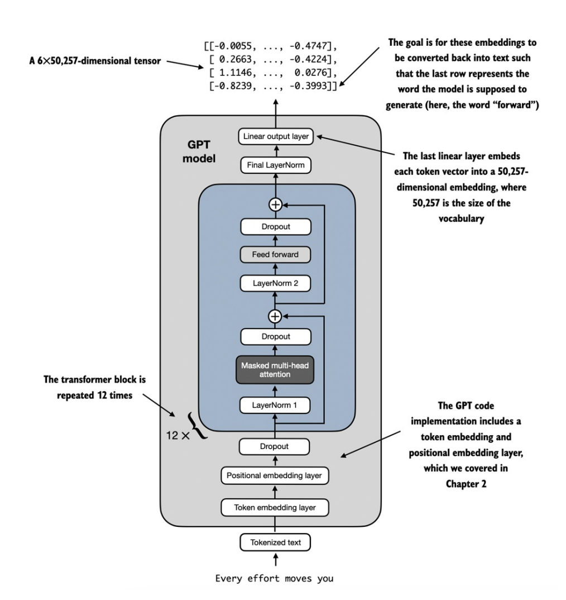
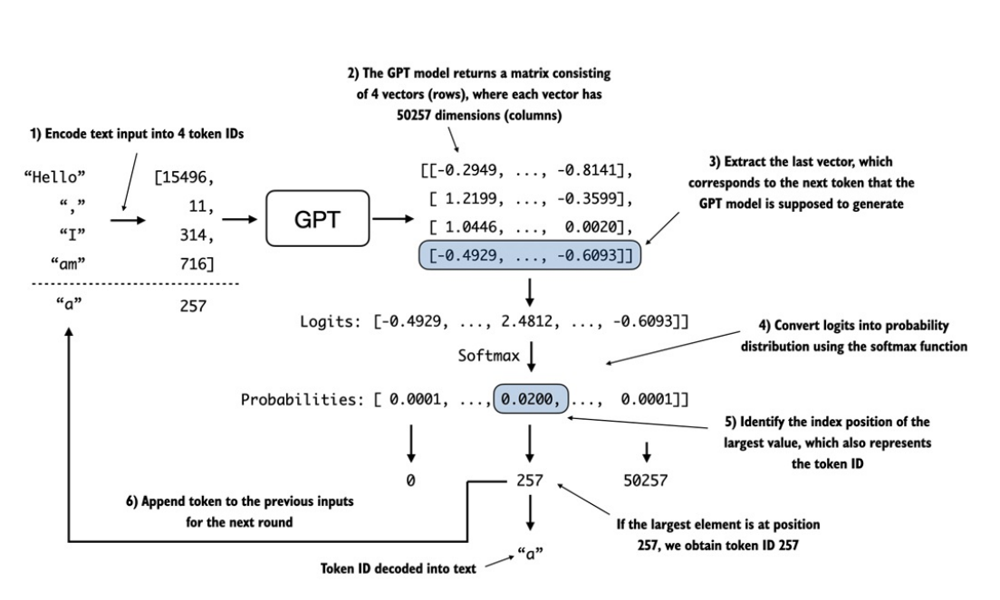
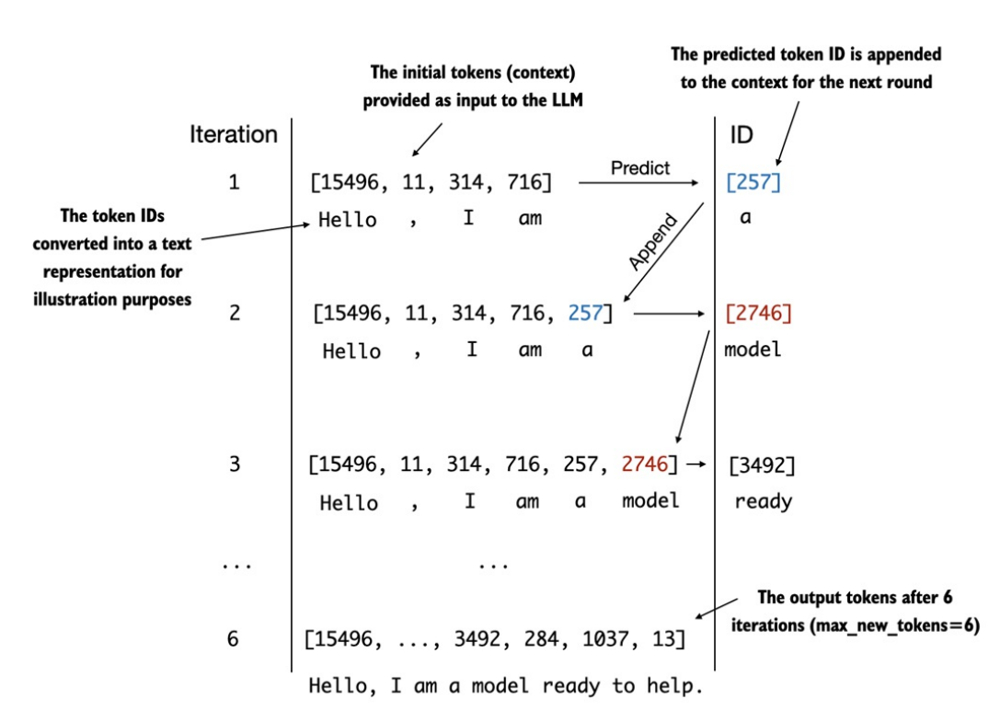

## GPT model
- Ở phần đầu ta đã triển khai kiến trúc tổng quan của _GPT_ qua `DummyGPTModel`, nhưng các thành phần như _DummyTransformerBlock_ & _DummyLayerNorm_ vẫn chưa được khởi tạo.

- Trong phần này ta sẽ thay thế chúng bằng các lớp `TransformerBlock` & `LayerNorm` thực tế để cho ra một phiên bản hoàn chỉnh, hoạt động được của mô hình _GPT-2_ nguyên bản với _124M tham số_. Cùng nhìn lại cấu trúc tổng thể của _GPT-2_ qua hình sau đây:

- 

- Với _GPT-2 124M tham số, _Transformer Block_ được lặp lại 12 lần (điều chỉnh qua _n\_layers_). Tương tự với _GPT-2 1542M tham số_ là 36 lần. Đầu ra của _Transformer Block cuối cùng_ sẽ đi qua 1 bước chuẩn hóa _LayerNorm_ trước khi đi tới _output layer_. Lớp này ánh xạ đầu ra của _Transformer_ vào 1 không gian cao chiều (trong trường hợp này là 50.257 chiều - _vocab\_size_).

    #### Tại sao output không phải là 1 số mà lại là 1 vector?
    - Vector đầu ra cuối cùng của _Transformer_ (thường có kích thước _768 hoặc 1024_) khi đi qua _lớp Linear_ cuối cùng sẽ được _ánh xạ tuyến tính_ lên kích thước tương đương với _bộ từ vựng (vocabulary size)_.

    - Nếu bộ từ vựng có 50.257 từ, vector đầu ra sẽ được chuyển thành 1 vector có độ dài 50.257, được gọi là các `logits`. Mỗi con số trong vector đại diện cho một "điểm số" của một từ tương ứng trong từ điển. 

    - Các _logits_ này sẽ được chuyển đổi sang _phân phối xác suất_, với mỗi vị trí trong vector sẽ là 1 con số thuộc khoảng _[0, 1]_, và tổng của chúng bằng 1. Hệ thống sẽ chọn ra những index của phần tử có xác suất cao nhất (hoặc chọn ngẫu nhiên dựa trên xác suất), _bộ Tokenizer_ sẽ mapping từ index sang văn bản.

- Code được triển khai tại phần `7. GPT Model` trong [`11. Placeholder-GPT.ipynb`](https://github.com/tyanfarm/build-LLM-from-scratch-notebook/blob/main/11.%20Placeholder-GPT.ipynb). 

## Generate text
- Quá trình mà một mô hình GPT chuyển đổi từ các tensor đầu ra thành văn bản bao gồm nhiều bước, như được minh họa trong hình dưới đây:

- 

- Khi đưa 4 tokens vào mô hình GPT, lớp đầu ra sẽ trả về `4 vector logits` (1 vector cho mỗi vị trí). Từ vector cuối cùng ta tính xác suất để cho ra được vị trí nào có xác suất lớn nhất, từ đó ánh xạ từ ID sang token tiếp theo (token thứ 5). Cứ lặp lại các bước như vậy đến khi đạt được số lượng token được tạo ra do người dùng chỉ định.

- 

- Hàm `generate_text_simple()` xem thêm tại phần `8. Generate text` trong [`11. Placeholder-GPT.ipynb`](https://github.com/tyanfarm/build-LLM-from-scratch-notebook/blob/main/11.%20Placeholder-GPT.ipynb).

- Như vậy là chúng ta đã hoàn thành việc sinh văn bản từ 1 _GPT model_ khởi tạo ban đầu. Ở chương sau ta sẽ tiến hành huấn luyện để mô hình có thể sinh văn bản có nghĩa.