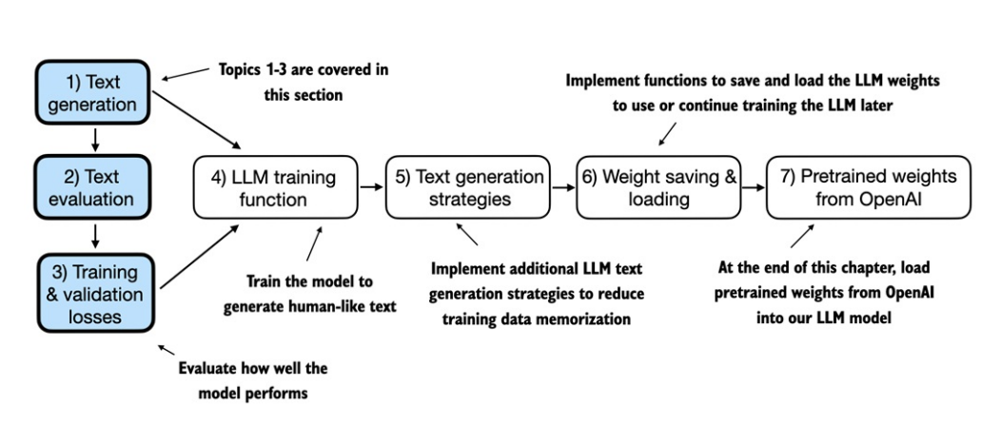
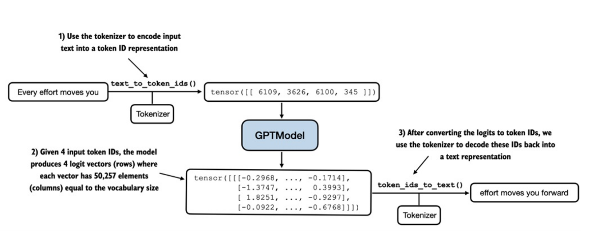
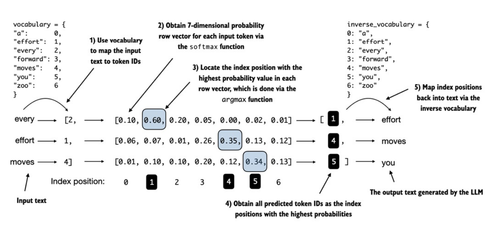
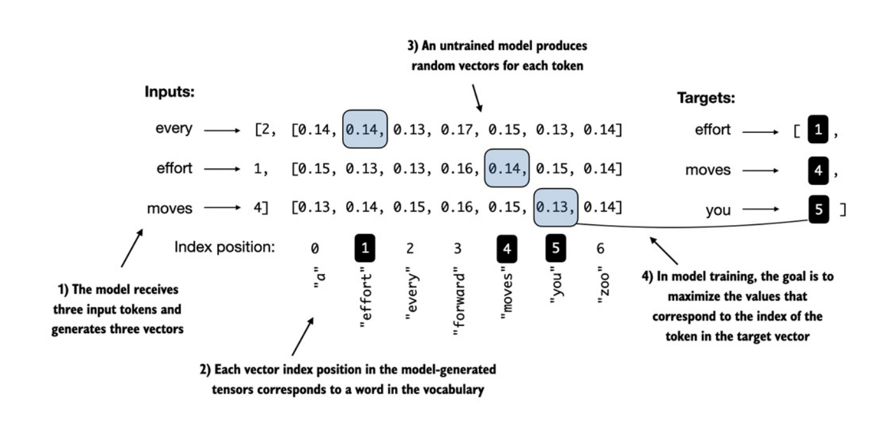
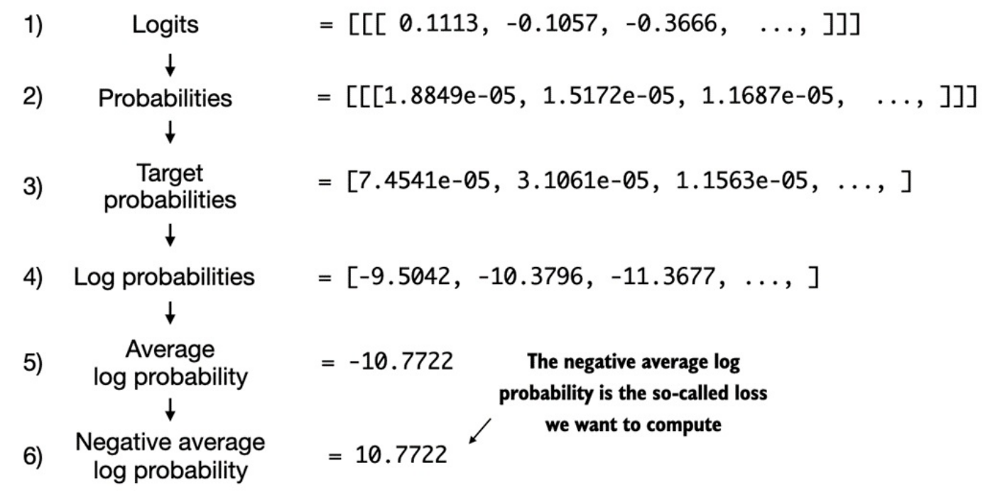

## Text Generation
- Quy trình sinh văn bản diễn ra qua các bước: Mã hóa (Encoding) $\rightarrow$ Mô hình tính toán $\rightarrow$ Embedding vector sang ID tokens $\rightarrow$ ID tokens sang text.

- 

- Tuy nhiên mô hình hiện tại vẫn đang tạo ra văn bản ngẫu nhiên và khác biệt so với mục tiêu vì vẫn chưa được huấn luyện. Tiếp theo đây ta sẽ đến phần đánh giá hiệu suất của văn bản do mô hình tạo ra thông qua một _đại lượng_ gọi là `"Hàm mất mát" (Loss)`.

- _Hàm Loss_ không chỉ hỗ trợ việc đánh giá văn bản đầu ra, mà còn là nền tảng để triển khai việc huấn luyện sau này - công cụ để cập nhật trọng số mô hình để cải thiện đầu ra văn bản trong quá trình _training_.

## Calculating Loss
- 

- Hình trên mô tả tính toán Loss khi huấn luyện được triển khai như thế nào, với mục tiêu là đo lường _"mức độ sai lệch"_ giữa các _token được tạo ra_ so với _token mục tiêu_. 

- Mục tiêu của huấn luyện mô hình là *làm tăng xác suất softmax tại các vị trí index tương ứng với các target token ID*. 

- Trước khi huấn luyện, mô hình tạo ra các vectơ xác suất cho token tiếp theo một cách ngẫu nhiên. Mục tiêu của quá trình huấn luyện mô hình là đảm bảo các giá trị xác suất tương ứng với các _target token ID_ được đánh dấu nổi bật tối đa, như hình dưới:

- 

#### Lan truyền ngược (Backpropagation)
- Làm thế nào để chúng ta tối đa hóa các giá trị xác suất softmax tương ứng với các _target token_. Về mặt tổng quan, ta cập nhật các _trọng số mô hình (model weights)_ sao cho mô hình đưa ra các giá trị xác suất cao hơn cho các _target token ID_ tương ứng mà ta muốn tạo ra. Việc cập nhật trọng số này được thực hiện thông qua một quá trình gọi là _backpropagation_ (Xem thêm tại [Appendix](./appendix.md)). 

- Lan truyền ngược đòi hỏi 1 hàm Loss dùng để tính toán chênh lệch giữa _đầu ra dự đoán mô hình_ và _đầu ra mong muốn thực tế_. Các bước tính toán hàm Loss thể hiện qua hình dưới đây:

- 

    + _Logits_ là vector scores output của mô hình với độ dài bằng _len(vocabulary)_, sau đó đưa qua hàm Softmax để có được _Probabilities_. Vì hiện tại chưa huấn luyện gì, nên _probability_ của _target token_ hiện tại sẽ rất thấp. Mục tiêu sẽ là tăng giá trị xác suất này lên tiến về 1.

    + Từ danh sách _Probabilities_ ở trên, ta sẽ lấy ra các _probability_ tương ứng với _target token ID_ để tạo thành _Target probabilities_, sau đó tính toán _Cross Entropy Loss_ trên vector target này (bước 4-6). Mục tiêu sẽ là kéo _Negative average log probability_ này giảm xuống 0.

- Hàm Loss _Cross Entropy_ thường được dùng cho các bài toán phân phối xác suất này.

#### Độ phức tạp (Perplexity)
- Thước đo này thường sử dụng cùng với _Cross Entropy Loss_ để đánh giá hiệu năng mô hình, cung cấp cái nhìn trực quan hơn. _Perplexity_ có thể được tính bằng công thức *perplexity = torch.exp(loss)*, trả về kết quả ví dụ *tensor(47678.8633)*. 

- Trong ví dụ này, giá trị trên tương đương với việc mô hình đang phân vân giữa khoảng *47.678 từ/token* trong _vocabulary_ để chọn ra token tiếp theo.
