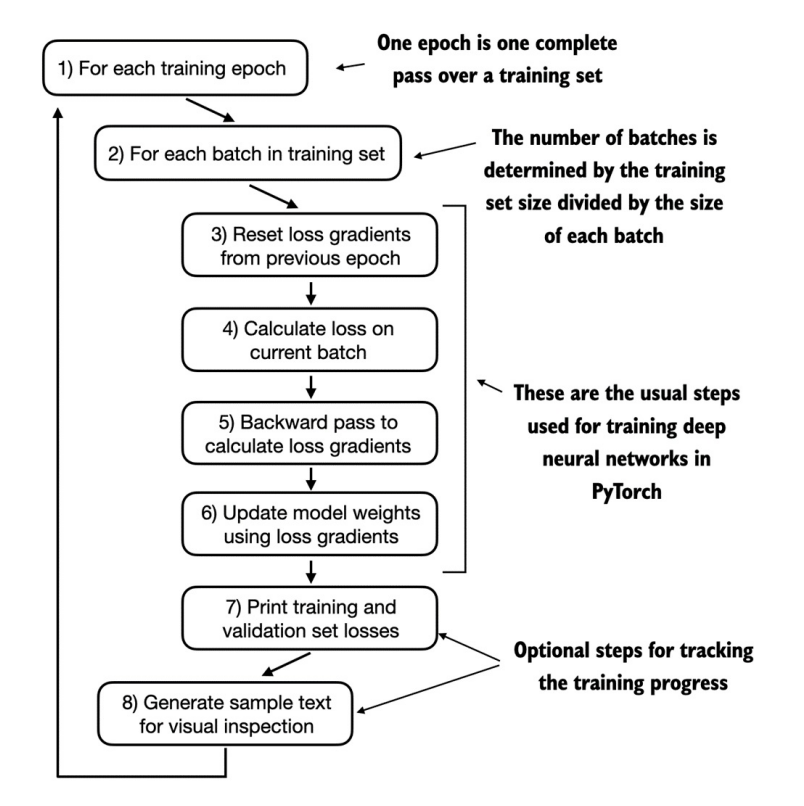
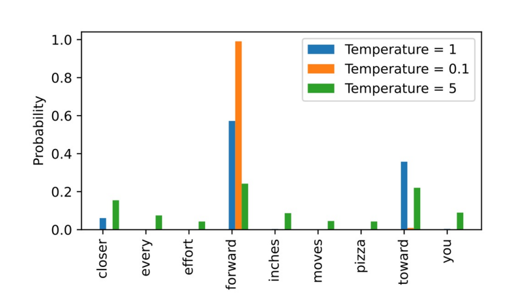
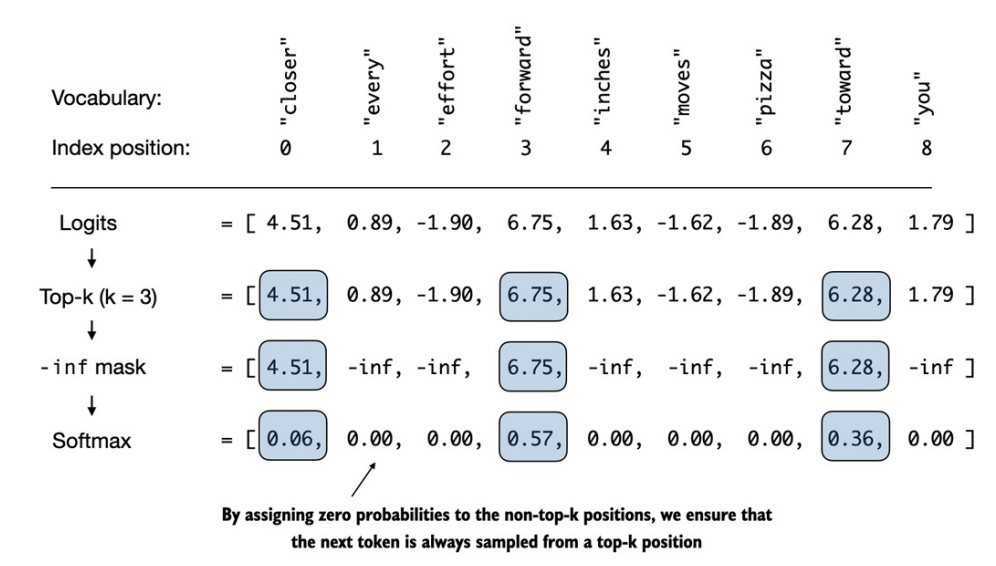

## Train an LLM

- Một vòng lặp huấn luyện mạng nơ-ron sâu điển hình trong PyTorch bao gồm nhiều bước, lặp qua các batch trong tập huấn luyện qua nhiều epoch. Trong mỗi vòng lặp, chúng ta tính toán hàm mất mát (loss) cho từng batch huấn luyện để xác định gradient của loss, từ đó cập nhật trọng số mô hình nhằm giảm thiểu loss trên tập huấn luyện.

- 

##  Decoding strategies to control randomness

### Temperature scaling
- Trước đây như các cách triển khai, ta luôn chọn token có xác suất cao nhất làm token kế tiếp bằng cách dùng *torch.argmax* (còn được gọi là _greedy decodding_). Để tạo ra văn bản có độ đa dạng cao hơn, ta có thể thay thế bằng 1 hàm _lấy mẫu từ phân phối xác suất_ (ở đây là các điểm xác suất mà LLM sinh ra cho từng từ tại mỗi bước tạo token).

- Công thức tính xác suất từ Logits:

    ##### Softmax tiêu chuẩn (temperature $T = 1$): 
    - Để chuyển đổi Logits thành phân phối xác suất ($P_i \in [0, 1]$ và $\sum P_i = 1$):

        

        $$P(x_i) = \frac{e^{z_i}}{\sum_{j=1}^{V} e^{z_j}}$$
        

        
    ##### Softmax kết hợp Temperature Scaling ($T > 0$)
    - Hệ số nhiệt độ $T$ được chia trực tiếp vào từng giá trị logit trước khi đưa qua hàm Softmax:

        

        $$P(x_i \mid T) = \frac{e^{\frac{z_i}{T}}}{\sum_{j=1}^{V} e^{\frac{z_j}{T}}}$$
        

        + $T \to 0$ (hoặc $T < 1$): Logit lớn nhất áp đảo hoàn toàn các logit còn lại $\to$ phân phối rất nhọn, mô hình đưa ra câu trả lời chuẩn xác, ít ngẫu nhiên.
        + $T = 1$: Giữ nguyên phân phối gốc của mô hình.
        + $T > 1$:Khoảng cách giữa các logit $\to$ phân phối đồng đều hơn, tăng tính sáng tạo nhưng dễ sinh ra câu vô nghĩa nếu $T$ quá cao.

        + 

- Với các cách phân phối xác suất ở trên, thì ta cần 1 cách để chọn token đầu ra, trước mắt có 2 phương pháp:

    ##### Greedy Search
    - Chọn token có xác suất cao nhất. 
    - Đặc điểm: Hoàn toàn ổn định (chạy 100 lần cùng một prompt sẽ ra 100 kết quả giống hệt nhau).

    ##### Multinomial Sampling
    - Mỗi token có cơ hội được chọn tỷ lệ thuận với xác suất $P(x_i)$ của nó:
    - Đặc điểm: Tăng tính đa dạng của câu từ. Token có xác suất thấp vẫn có khả năng được chọn. 

### Top-K sampling
- Trong phần này, chúng ta giới thiệu một khái niệm khác mang tên _top-k sampling_. Khi kết hợp với lấy mẫu xác suất và điều chỉnh nhiệt độ, phương pháp này có thể cải thiện chất lượng sinh văn bản.

- Sử dụng top-k sampling với $k=3$, chúng ta tập trung vào 3 token có logit cao nhất và che toàn bộ các token còn lại bằng giá trị âm vô cùng ($-\infty$) trước khi áp dụng hàm softmax. Thao tác này tạo ra một phân phối xác suất gán giá trị 0 cho tất cả các token không nằm trong top-k.

    + 

- Cuối cùng ta có thể _điều chỉnh temperature_ và _multinomial sampling_ nhằm chọn ra token tiếp theo từ 3 token lấy từ top-k.

### Top-P sampling
- Đối với Top-P thì bắt buộc phải đi qua _hàm Softmax_ trước rồi mới xác định ngưỡng.

- Vì Top-p chọn tập hợp token có tổng xác suất tích lũy đạt ngưỡng $p$ (ví dụ: $p = 0.9$), ta tính phân phối xác suất, sau đó sắp xếp token theo thứ tự xác suất từ cao xuống thấp và tính tổng sao cho tổng xác suất của chúng $\le p$.

- Cuối cùng Gán $-\infty$ cho các logit bị loại (hoặc gán xác suất của chúng về $0$) và tính lại Softmax trên nhóm còn lại để tổng xác suất bằng $1$.

## Conclusions
- Vậy là nội dung về phần `Build LLM from scratch` xin kết thúc tại đây. Chúc các bạn có 1 ngày tốt lành. 😁😁😁
