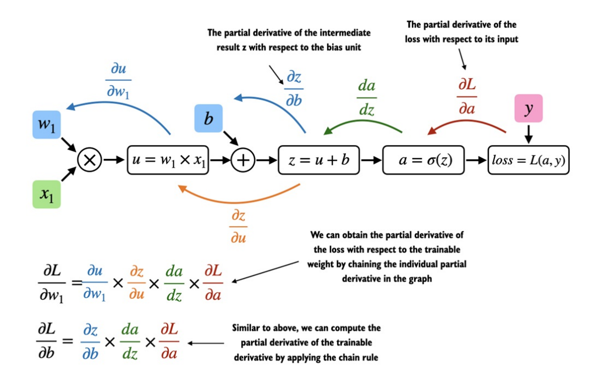

## Đạo hàm & Gradients
- `Gradient` là yếu tố bắt buộc khi huấn luyện mạng nơ-ron thông qua thuật toán `lan truyền ngược` _backpropagation_. Thuật toán này áp dụng `quy tắc chuỗi` (_chain rule_) trong giải tích như hình dưới đây:

- 

- _Đạo hàm riêng_ dùng để đo lường tốc độ thay đổi của 1 hàm số đối với 1 trong các biến số của nó. 

- _Gradient_ là 1 vectơ chứa tất cả các đạo hàm riêng của 1 hàm đa biến.
    
    + Ví dụ: Nếu có 2 trọng số $w_1$ & $w_2$, _gradient_ là vector $\nabla L = [\frac{\partial L}{\partial w_1}, \frac{\partial L}{\partial w_2}]$.