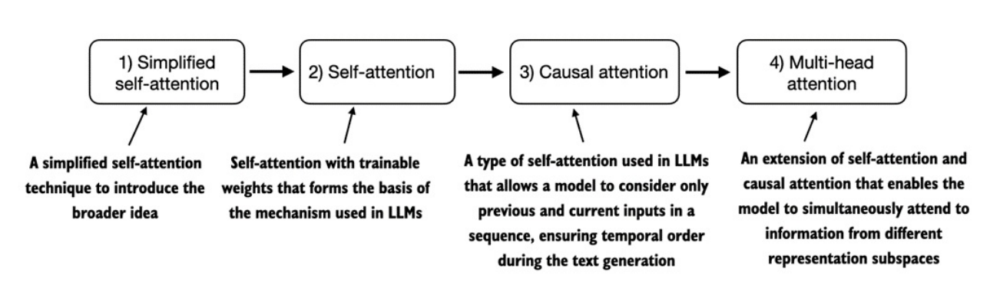
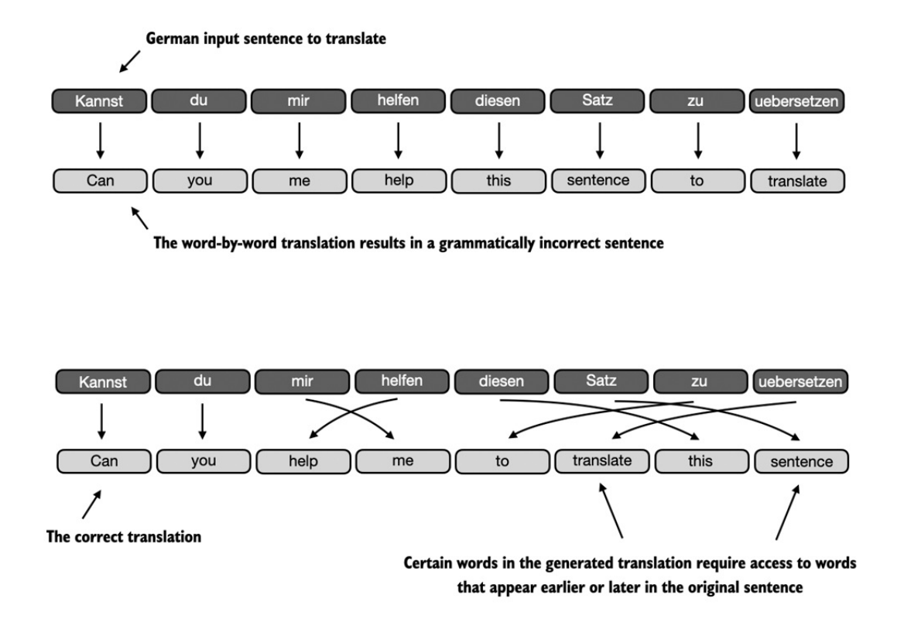
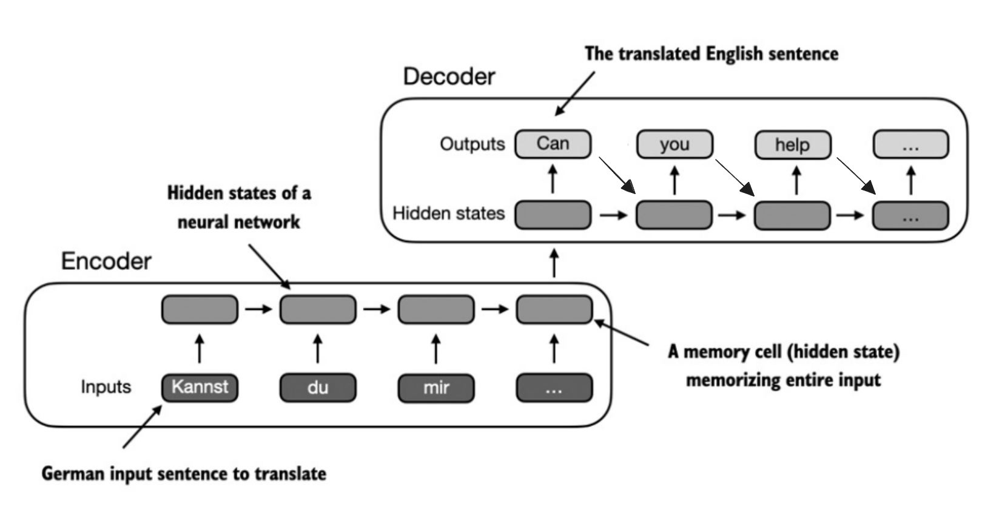
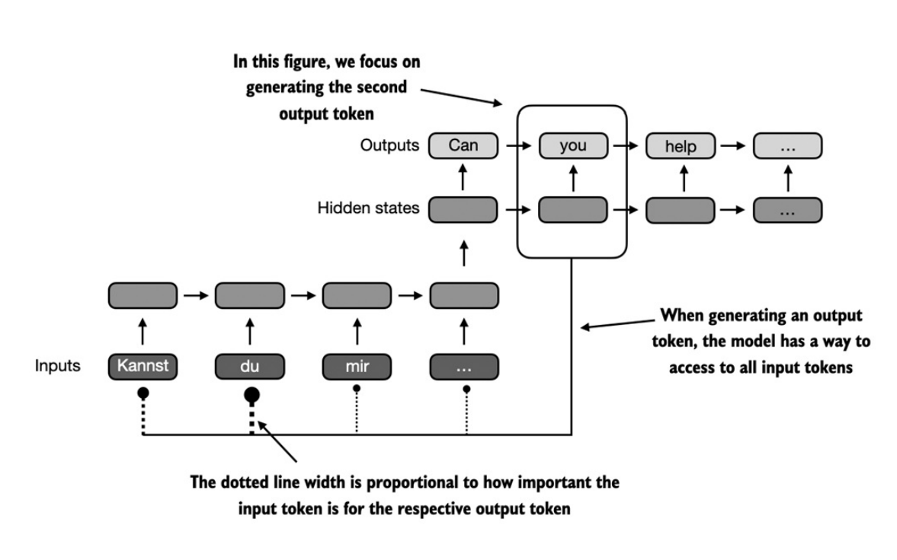

- Cơ chế `attention` là 1 chủ đề rất rộng. Trong phần này, chúng ta sẽ triển khai `4 biến thể` khác nhau của *attention mechanisms* như hình dưới đây:
    
    

    + Bắt đầu với *phiên bản đơn giản của self-attention* (1) trước khi *bổ sung các weights có thể train* (2).

    + Tiếp theo, cơ chế *casual attention* (3) thêm `1 mask` vào self-attention, cho phép LLM sinh từng từ một.

    + Cuối cùng, *multi-head attention* tổ chức attention mechanisms thành nhiều "head" song song, nắm bắt nhiều đặc trưng của input data.

## Khó khăn trong việc mô hình hóa chuỗi dài
- Trước khi đi vào cơ chế `self-attention`, vốn là *core* của LLM, hãy xem vấn đề của các kiến trúc *không có attention* xuất hiện trước LLM là gì.

    

- Giả sử chúng ta muốn phát triển một `mô hình dịch ngôn ngữ`. Như hình trên, ta không thể chỉ đơn giản *dịch* từng từ một từ German qua English do khác biệt về `cấu trúc ngữ pháp`.

- Để giải quyết vấn đề này, người ta thường sử dụng một `mạng neural` với *2 module con* `Encoder và Decoder`. Nhiệm vụ của Encoder là *đọc và xử lý toàn bộ văn bản*, sau đó Decoder sẽ *sinh ra văn bản dịch*.

- Trước khi `Transformer` ra đời, Mạng nơ-ron hồi quy (Recurrent Neural Networks - RNNs) là kiến trúc `encoder-decoder` phổ biến nhất cho *dịch máy*.

- Trong 1 `RNN cơ bản` (1 layer RNN) có công thức sau:
    + `hidden state` $h_t = f(W_{xh}x_t + W_{hh}h_{t-1} + b_h)$, với:

        + $h_{t-1}$ là `hidden state` của bước trước;

        + $x_t$ là `input` tại thời điểm `t`;

        + $h_t$ là `hidden state` tại thời điểm `t`;

    + `output` $y_t = g(W_{hy}h_t + b_y)$, với:

        + $h_t$: `hidden state` tại thời điểm `t`;
        + $g(⋅)$: `hàm kích hoạt` (ví dụ *softmax* nếu là *phân phối xác suất* từ tiếp theo)

- Từ công thức trên có thể thấy rằng, `đầu ra của bước trước được đưa trở lại làm đầu vào của bước tiếp theo`. 

- Trong một `encoder-decoder RNN`, văn bản đầu vào được đưa vào `encoder`, nó sẽ xử lý lần lượt theo từng token. Ở mỗi token, encoder sẽ cập nhật trạng thái ẩn (`hidden state`) của mình, *cố gắng nén toàn bộ input data* vào `final hidden state`. Sau đó, `decoder` sẽ dùng `final hidden state` này để sinh ra `câu dịch`, từng từ một. 

- Hidden state thứ `t` sẽ được tạo ra bằng hidden state thứ `t-1` và token thứ `t-1` (công thức thứ 1, với $x_t$ là $y_{t-1}$ ở decoder). Token thứ `t` ($y_t$) sẽ được tạo ra bằng cách sử dụng hidden state thứ `t` (công thức thứ 2)

    

- Vấn đề của `encoder-decoder RNN` là trong lúc `decoding`, RNN không thể truy cập vào các hidden state phía trước mà chỉ dựa được vào `final hidden state` (có thể thấy rõ từ công thức). Do đó, toàn bộ input data chỉ được nén vào 1 vector duy nhất. Điều này
dễ làm `mất mát thông tin`, đặc biệt với câu dài, có phức tạp quan hệ xa.

## Nắm bắt các quan hệ phụ thuộc với cơ chế attention
- Sau 3 năm, `Transformer` gốc ra đời với cơ chế `self-attention` lấy cảm hứng từ  với cơ chế attention
- `RNN` có nhược điểm là *buộc phải ghi nhớ toàn bộ câu đã mã hóa chỉ trong 1 hidden state duy nhất*.

- Để khắc phục, năm 2014 cơ chế `Bahdanau attention` ra đời:
    + Cơ chế này chỉnh sửa `encoder-decoder RNN` để decoder có thể *lựa chọn các hidden state khác nhau của chuỗi input tại mỗi bước decode*.

    + Hình dưới đây minh họa *ý tưởng tổng quát* của `attention` chứ không mô tả chính xác cách triển khai *Bahdanau*.

    + 

- Sau 3 năm, `Transformer` gốc ra đời với cơ chế `self-attention` lấy cảm hứng từ `Bahdanau attention`.

- Tiếp theo chúng ta sẽ đi sâu vào code cơ chế `self-attention` trước khi code các phần khác của LLM giống GPT.