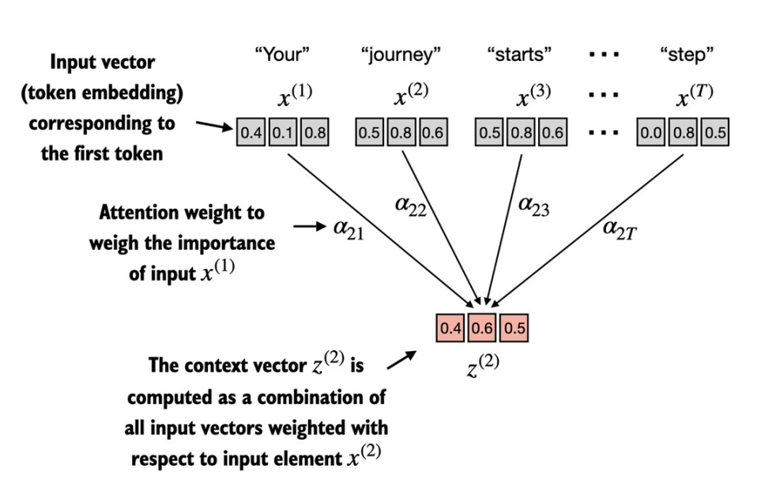
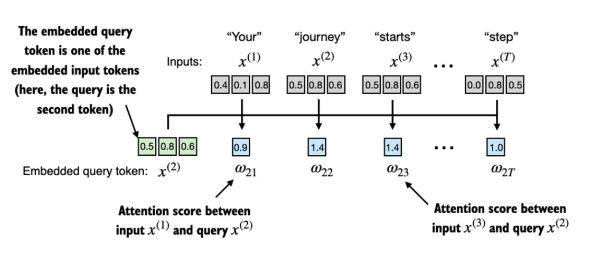
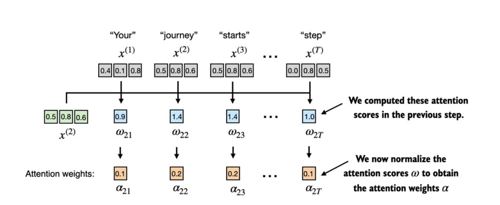
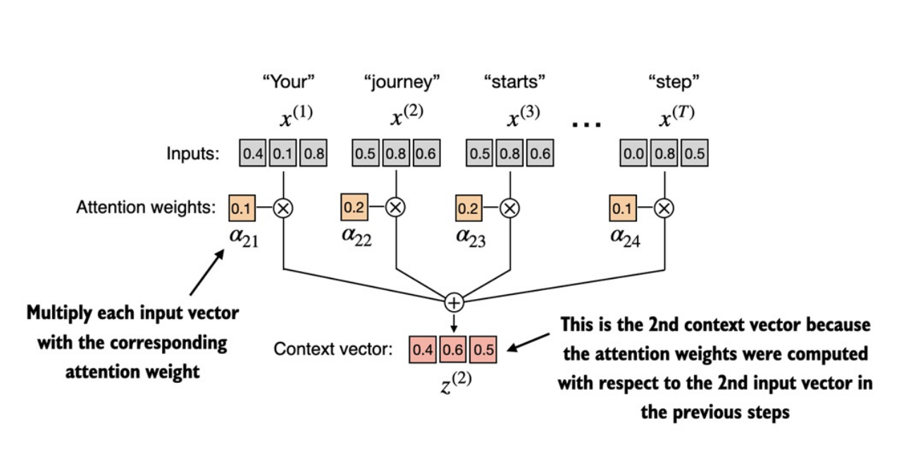
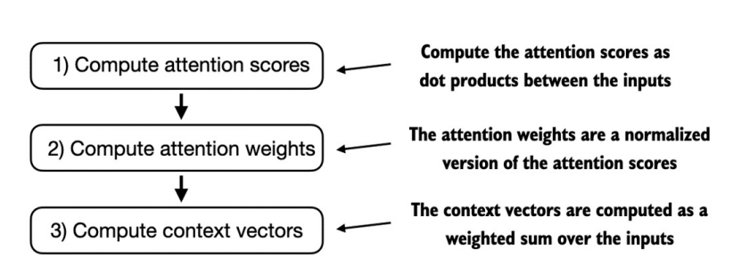

- "self" trong `self-attention` là gì? 
    
    + Như ở phần trước, qua ảnh minh họa ta đã hình dung `attention truyền thống` dùng để kết nối *encoder và decoder*, giải quyết việc Decoder nên nhìn phần nào trong input.

    + Với `self-attention`, mỗi `token` trong `input` không chỉ nhìn `bản thân nó` mà còn nhìn `toàn bộ các token khác trong chuỗi` để quyết định bản thân nên biểu diễn như nào.

    + *Ví dụ*: “The cat sat on the mat”
        
        + Khi biểu diễn “cat”, mô hình có thể nhìn sang “sat” (động từ) để hiểu ngữ cảnh.

        + Khi biểu diễn “mat”, mô hình có thể nhìn cả “on” và “the” để rõ nghĩa.

## Cơ chế self-attention đơn giản không có weights

- Chuỗi đầu vào $x$:
    
    + Gồm $T$ phần tử: $x^{(1)}$, $x^{(2)}$, ..., $x^{(T)}$.

    + Mỗi phần tử là `embedding vector` của từng `token`.

- Attention weights $\alpha_{2j}$: 

    + Mức độ quan trọng của từng token $x^{(j)}$ (bao gồm bản thân token 2 đó) đối với việc biểu diễn token số 2 trong ngữ cảnh toàn câu.

- Mục tiêu của `self-attention`:
    
    + Với mỗi $x^{(i)}$, ta tính ra 1 `context vector` $z^{(i)}$.

    + $z^{(i)}$ là `embedding vector` giàu ngữ cảnh toàn câu.

- Ví dụ cụ thể với từ `"journey"` trong hình trên:

    + $x^{(2)}$ là `embedding` gốc của `"journey"`.
    
    + Từ đó ta tính `embedding` $z^{(2)}$: vector `"lấy"` thông tin từ các token trong câu. Việc `"lấy"` nhiều hay ít phụ thuộc vào các `attention weights` $\alpha_{2j}$.

 

- Bước đầu tiên để triển khai `self-attention` là tính ra các `giá trị trung gian` $ω$.

- $ω$ còn được gọi là `attention scores` thể hiện độ tương đồng giữa các token trong câu.

- Ta đang tính `context vector` $z^{(2)}$ cho token "journey", nên $x^{(2)}$ sẽ làm `query`.

- Ta tính `dot product` (tích vô hướng) với từng `embedding` trong chuỗi:

    + $ω_{21} = x^{(2)} ⋅ x^{(1)}, ω_{22} = x^{(2)} ⋅ x^{(2)}, ..., ω_{2T} = x^{(2)} ⋅ x^{(T)}$

    + `Tích vô hướng` còn là *thước đo độ tương đồng*. Tích càng lớn $\rightarrow$ hai vector càng cùng hướng, Tích càng nhỏ hoặc âm $\rightarrow$ hai vector càng ngược hướng.

- Kết quả ta có 1 dãy `attention scores` $ω_{21}, ω_{22}, ..., ω_{2T}$.

- Danh sách `attention weights` được tính bằng cách truyền `attention scores` qua hàm `softmax` để chuyển về _phân phối xác suất_.

- Code minh họa xem tại [`6. Self-attention_without_weights.ipynb`](https://github.com/tyanfarm/build-LLM-from-scratch-notebook/blob/main/6.%20Self-attention_without_weights.ipynb).

- Sau khi đã có `attention weights`, `context vector` $z^{(2)}$ được tính bằng công thức sau:
    
    $$ z^{(2)} = \sum_{j=1}^{T} \alpha_{2j} ⋅ x^{(j)} $$

- Phần sau ta sẽ tiến hành tính toán tất cả các `context vector` này đồng thời, thay vì chỉ tính cho một `token 2` như này.

## Tính toán attention weights cho tất cả các token đầu vào
- Ở phần trước ta đã tính `attention weights` & `context vector` cho `input token thứ 2`. Ở phần này ta sẽ _mở rộng phép tính_ này để tính `attention weights` & `context vector` cho _tất cả_ các `input token`.

- Quá trình này nhìn chung được tính toán qua 3 bước:
    + 

- _Đầu tiên_, ở bước 1, ta sử dụng `2 vòng for` để tính `dot product` cho tất cả `các cặp input tokens`. Tuy nhiên _vòng lặp_ thường chạy chậm, thay vào đó ta có thể dùng _phép nhân ma trận (matrix multiplication)_ ($X⋅X^T$)

- Cả 3 bước này được triển khai tại [`6. Self-attention_without_weights.ipynb`](https://github.com/tyanfarm/build-LLM-from-scratch-notebook/blob/main/6.%20Self-attention_without_weights.ipynb).