## Word Embeddings
- Các mô hình mạng nơ ron học sâu (Deep neural network models), bao gồm cả LLMs, không thể xử lí trực tiếp `văn bản thô`. Do đó, ta cần một cách để biểu diễn các từ thành *các vector có giá trị liên tục*.

- Khái niệm này được gọi là `embedding`. 

- Word Embedding có thể có số chiều khác nhau, từ 1 đến hàng nghìn. 

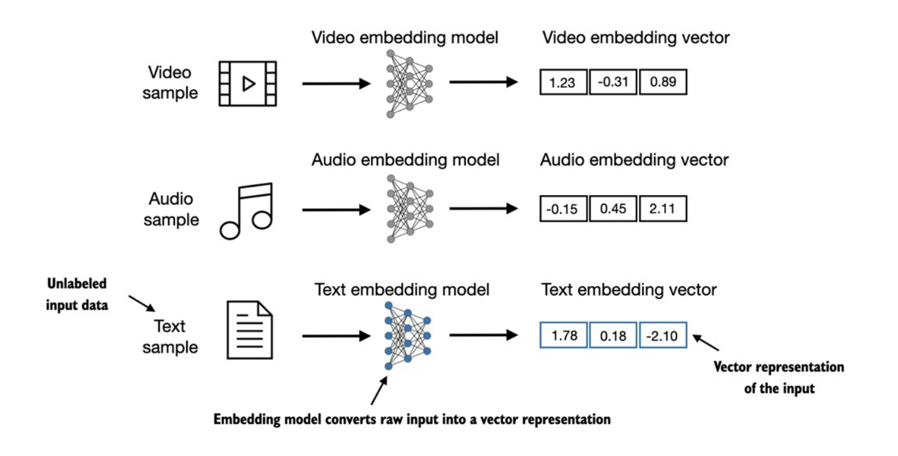

- Trong khi ta có thể sử dụng các pretrained model như `Word2Vec` để tạo embedding cho các mô hình máy học, thì `LLM` tự sinh ra embedding riêng ở *input layer* và các embedding được cập nhật trong quá trình huấn luyện. 

- Hơn nữa, `LLM` còn có khả năng tạo ra các embedding giàu ngữ cảnh (`contextual embedding`), sẽ được thảo luận ở phần 3. Các phần tiếp theo trong phần này bao gồm: *splitting text into words*, *converting words into tokens* & *turning tokens into embedding vectors*

## Tokenizing text
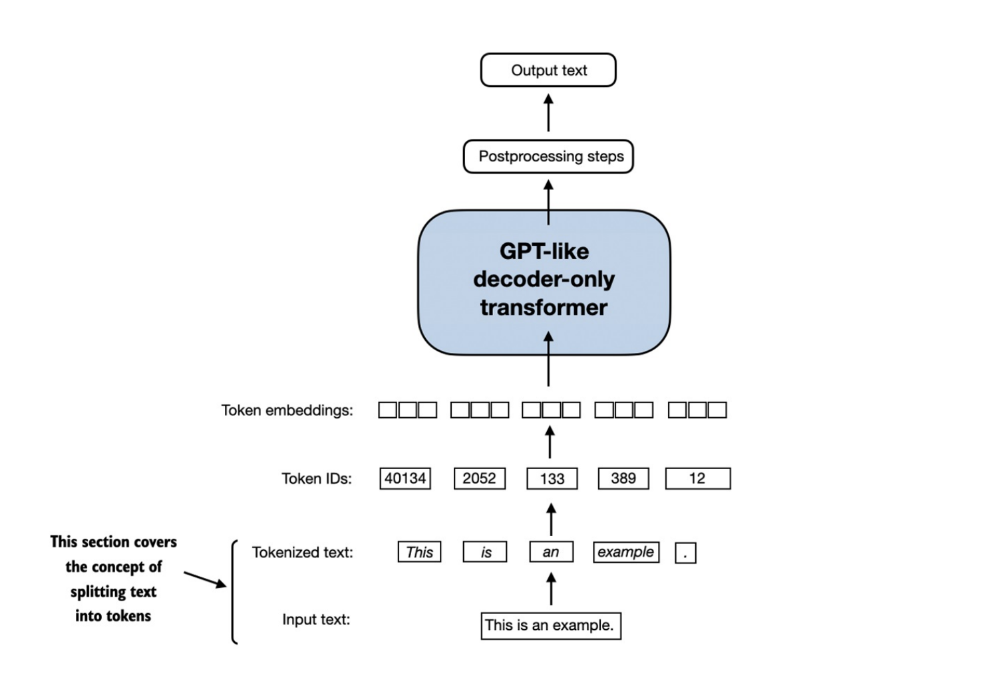

- Bắt đầu với vài mẫu text, ta có thể dùng `re.split` để split theo khoảng trắng như sau:
    ```
    import re
    text = "Hello, world. This, is a test."
    result = re.split(r'(\s)', text)
    print(result)
    ```

- Kết quả sẽ là 1 list các từ và kí tự sau:
    ```
    ['Hello,', ' ', 'world.', ' ', 'This,', ' ', 'is', ' ', 'a', ' ', 'test.']
    ```

- Tuy nhiên, vẫn còn 1 vài từ dính với các kí tự dấu câu, ta sẽ tách ra thành các phần tử riêng:
    ```
    result = re.split(r'([,.]|\s)', text)
    print(result)
    ```

- Đây là kết quả:
    ```
    ['Hello', ',', '', ' ', 'world', '.', '', ' ', 'This', ',', '', ' ', 'is', ' ', 'a', ' ', 'test', '.']
    ```

- Về các *whitespaces*, cần giữ hay loại bỏ? Loại bỏ sẽ giúp giảm nhu cầu về bộ nhớ & tính toán. Tuy nhiên, giữ lại có thể hữu ích nếu huấn luyện các mô hình nhạy cảm với cấu trúc chính xác (ví dụ: mã Python nhạy cảm với các khoảng *\tab*).
    ```
    result = [item for item in result if item.strip()]
    print(result)
    ```

    ```
    ['Hello', ',', 'world', '.', 'This', ',', 'is', 'a', 'test', '.']
    ```

- Phương pháp *tokenize* trên hiệu quả với các đoạn text đơn giản. Ta sẽ điều chỉnh thêm để nó có thể xử lý được nhiều loại dấu câu khác (`?, !, ;, ...`):
    ```
    text = "Hello, world. Is this-- a test?"
    result = re.split(r'([,.:;?_!"()\']|--|\s)', text)
    result = [item.strip() for item in result if item.strip()]
    print(result)
    ```

    ```
    ['Hello', ',', 'world', '.', 'Is', 'this', '--', 'a', 'test', '?']
    ```

    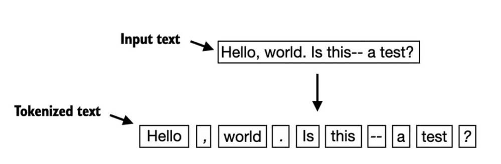

## Converting tokens into token IDs
- Để ánh xạ các tokens trước đó thành các token IDs, trước tiên chúng ta cần tạo `vocabulary`, cụ thể được minh họa như sau:

    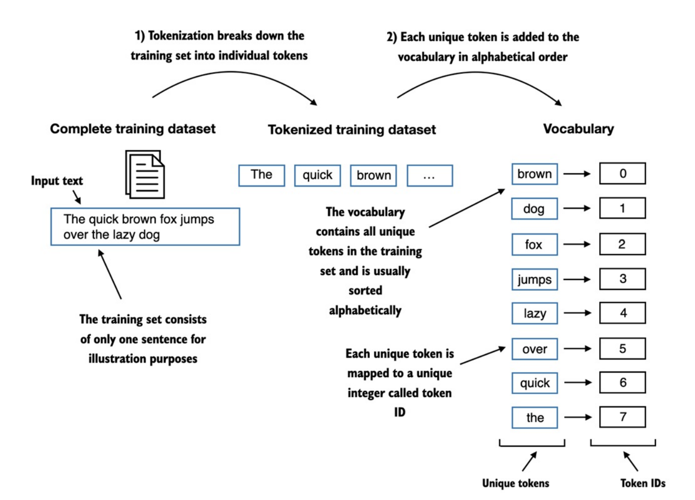

#### Implementing a simple text tokenizer
- Các bộ tokenizer thường có 2 phương thức chung: 
    + `Encoder`: nhận vào 1 đoạn văn bản mẫu, tách nó thành token riêng lẻ rồi chuyển thành các ID token.
    + `Decoder`: nhận vào các ID token, chuyển ngược thành văn bản.

    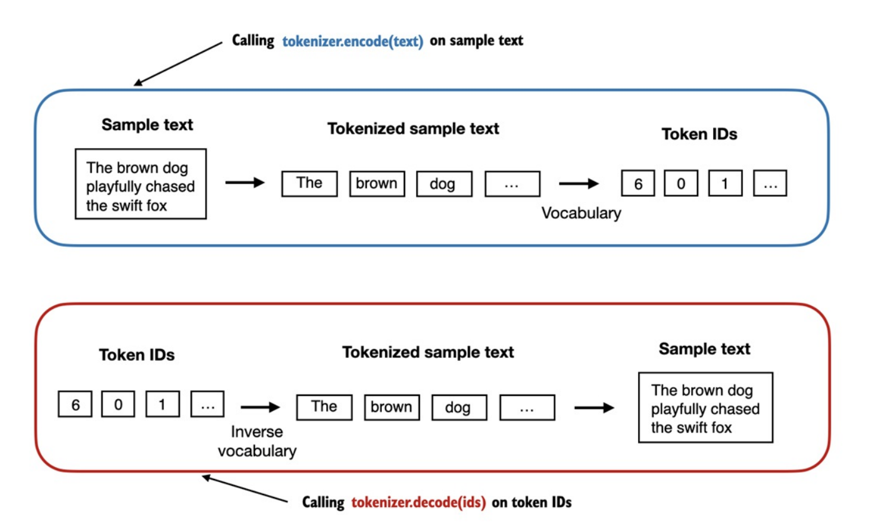

- Phần code minh họa sẽ được trình bày trong `Tokenizing.ipynb`

- Có một vấn đề là với những từ mà *vocabulary* chưa có, `tokenizer` sẽ không ánh xạ sang *token IDs* được. Điều này cho thấy cần phải chuẩn bị 1 tập training lớn và đa dạng hơn để mở rộng cho *vocabulary*.

- Ở phần sau, ta sẽ tiếp tục thử nghiệm `tokenizer` trên văn bản chứa những từ mà *vocabulary* chưa có, đồng thời thảo luận về các `token đặc biệt` bổ sung có thể được sử dụng để cung cấp thêm ngữ cảnh cho LLM trong quá trình training. 

## Adding special context tokens
- Ở phần này, ta sẽ bổ sung *vocabulary* đã triển khai ở phần trước để hỗ trợ 2 token mới là `<|unk|>` và `<|endoftext|>`

    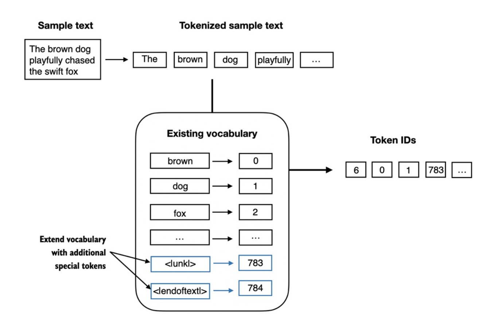

- Như hình ở trên, ta có thể cho `tokenizer` sử dụng token `<|unk|>` nếu gặp 1 từ không nằm trong *vocabulary* và token `<|endoftext|>` giữa 2 đoạn văn bản không liên quan. 

- Ví dụ, khi huấn luyện các LLM kiểu GPT trên nhiều tài liệu hoặc sách độc lập, việc chèn một token trước mỗi tài liệu hoặc cuốn sách tiếp nối sau một nguồn văn bản trước đó là điều thường gặp để giúp LLM hiểu rằng mặc dù các văn bản này được nối lại để training, nhưng chúng không liên quan đến nhau.

- Code triển khai xem thêm tại `Tokenizing.ipynb`

- Tùy thuộc vào từng mô hình LLM, một số nhà nghiên cứu còn xem xét thêm các token đặc biệt như:
    + `[BOS] (beginning of sequence)`: đánh dấu sự bắt đầu của 1 văn bản.
    + `[EOS] (end of sequence)`: Token nằm ở cuối văn bản, tương tự như `<|endoftext|>`.
    + `[PAD] (padding)`: Khi training LLM với *batch_size > 1*, để đảm bảo các văn bản có cùng độ dài, những văn bản ngắn hơn sẽ được mở rộng hoặc thêm bằng token `[PAD]` cho đến khi bằng với độ dài văn bản dài nhất trong *batch*.

- Lưu ý rằng các token được sử dụng cho mô hình GPT không cần những token trên, chỉ dùng `<|endoftext|>` cho đơn giản. Token `<|endoftext|>` tương tự như token `[EOS]` nêu trên, đồng thời, `<|endoftext|>` cũng được dùng để padding. Tuy nhiên, chúng ta sẽ khám phá ở các chương sau, khi training trên *dữ liệu batch*, ta thường sử dụng `mask` (nghĩa là bỏ qua các token được *padding*). Như vậy, token nào được chọn để *padding* không còn quan trọng nữa.

- Ngoài ra, `tokenizer` dùng cho GPT cũng không sử dụng `<|unk|>` cho những từ ngoài *vocabulary*. Thay vào đó, các mô hình GPT sử dụng `BPE (Byte Pair Encoding)` Tokenizer - một phương pháp chia nhỏ từ thành các `subword units (đơn vị con) - điều mà chúng ta sẽ thảo luận ở phần tiếp theo.

## Byte Pair Encoding
- Thuật toán của `BPE` sẽ tách những từ không có trong *vocabulary* thành các `subword units` hoặc thậm chí thành từng kí tự riêng lẻ, cho phép xử lí được các từ nằm ngoài *vocabulary*.

    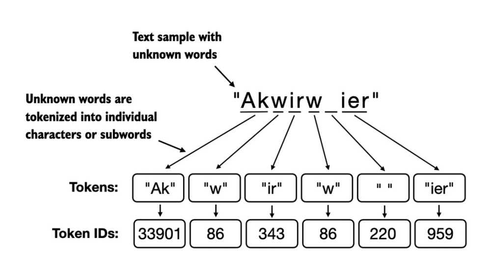

##  Data sampling with a sliding window
- Các phần trước đã trình bày chi tiết về các bước tokenization và việc chuyển đổi từ các `token dạng chuỗi` sang các `token IDs dạng integer`. Bước tiếp theo, trước khi có thể tạo ra `embeddings` cho LLM, là cần tạo ra các cặp `input-target` để train LLM như hình dưới đây:

    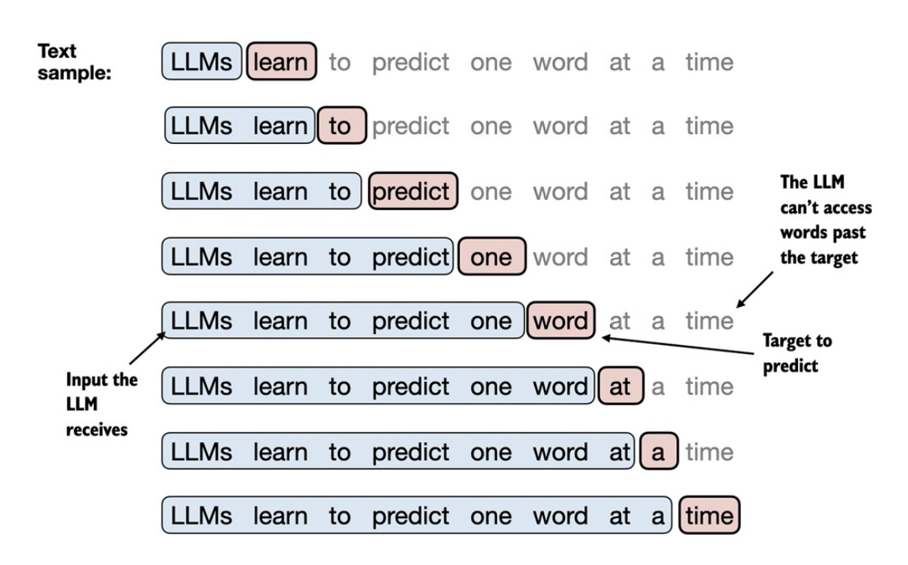

- Trong phần này ta sẽ triển khai một `Data Loader` để lấy ra các cặp `input-target` kiểu như sau:
    
    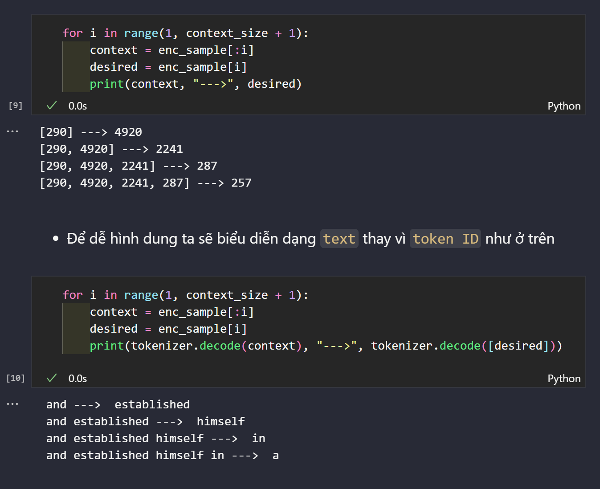

- Để triển khai `Data Loader` hiệu quả, ta đưa `input` vào 1 `Tensor X`, trong đó mỗi hàng biểu diễn ngữ cảnh đầu vào. `Tensor Y` chứa các `target` tương ứng, được tạo ra bằng cách `dịch đầu 1 vị trí`:

    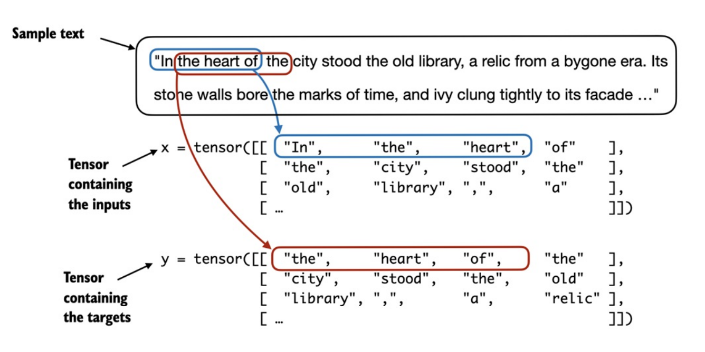

- Khi tạo nhiều `batch` từ `input dataset`, ta sử dụng `sliding window` trên văn bản. 
    + Nếu `stride == 1`, `input window` sẽ dịch sang `1 vị trí` khi tạo batch tiếp theo.
    + Nếu đặt `stride` bằng với kích thước cửa sổ đầu vào (`max_length`), ta có thể tránh được `overlap` giữa các batch.

    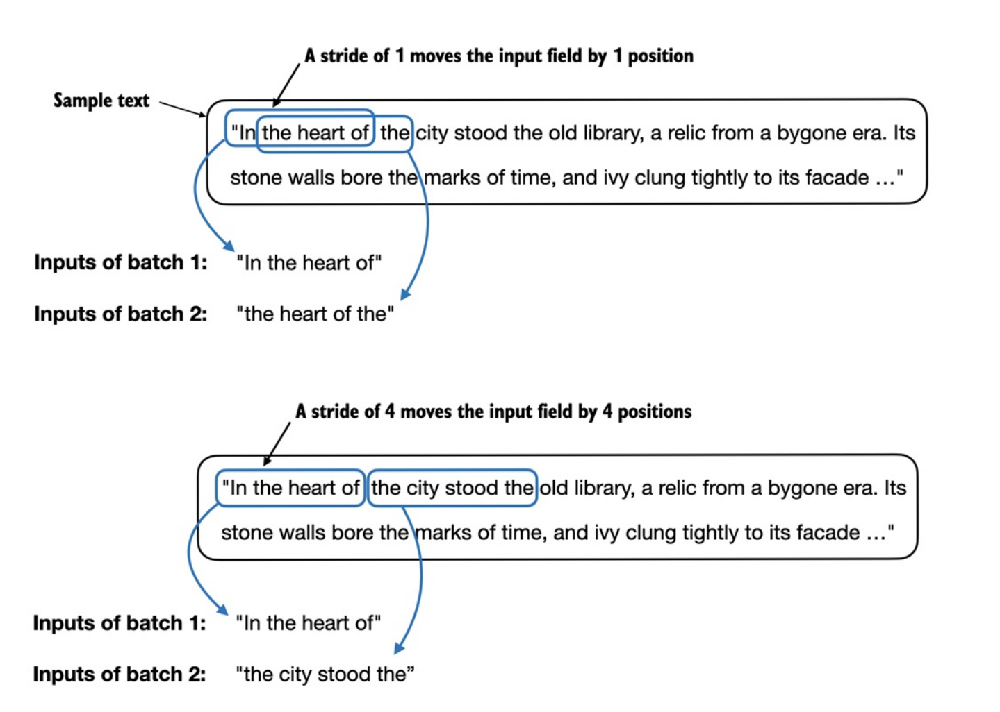

- Code triển khai có thể xem qua `3. Data_sampling.ipynb`

## Creating Token Embeddings
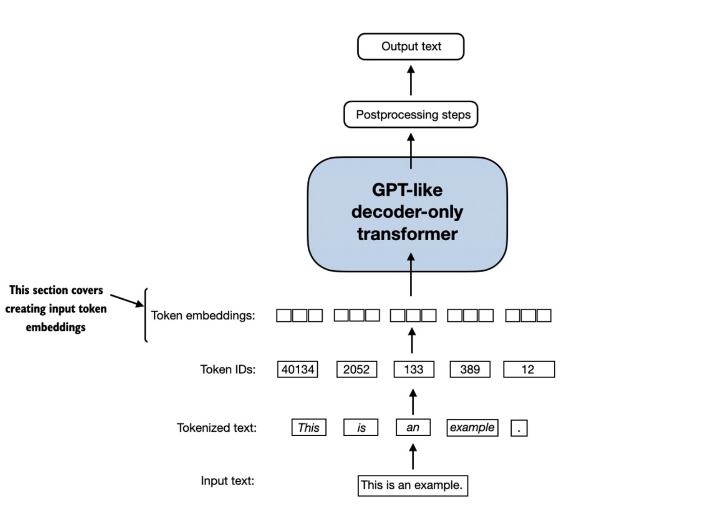

- Các `trọng số embedding` sẽ được khởi tạo ngẫu nhiên ban đầu. Các `weights` này sẽ được *tối ưu hóa* trong quá trình training LLM.

- Một `biểu diễn vector liên tục (continuous vector representation)`, hay còn gọi là `embedding`, được huấn luyện bởi thuật toán `lan truyền ngược (backpropagation)` (Có thể đọc thêm tại *Appendix A.4, Automatic differentiation made easy*)

- Phần code minh họa xem thêm tại `Token_embedding.ipynb`

### Embedding Layer và Matrix Multiplication (Nhân ma trận)
- Trước tiên ta cùng ôn lại một chút về khái niệm `one-hot encoding`. Kĩ thuật này sẽ chuyển đổi *categorical data* thành vector nhị phân: 
    + Mỗi phần tử sẽ là *0 hoặc 1*.
    + Chỉ có duy nhất 1 vị trí bằng *1*, còn lại *0*.
    + Ví dụ, `["cat", "dog", "tiger"]`: 
        + `"cat" -> [1, 0, 0]` 
        + `"dog" -> [0, 1, 0]`
        + `"tiger" -> [0, 0, 1]`

    + Trước đây, `one-hot encoding` thường dùng để biểu diễn *token/word* nhưng vector này rất *thưa (sparse)* & *có chiều rất lớn*, vì vậy được thay thế bằng `embedding layer`.
    + Ví dụ: *GPT-3 có vocab ~50k → mỗi token thành vector 50k chiều, trong đó 49,999 phần tử = 0*.

- `Embedding layer` thực chất là `one-hot vector` x `weights matrix` ($\mathbf{W}$). 

- Từ code minh họa, có thể hình dung cách `embedding layer` hoạt động. Nếu *input $\mathcal{x}$* là `one-hot vector` (chỉ có một giá trị bằng 1), thì khi nhân với `weights matrix` ($\mathbf{W}$) $\rightarrow$ chính là chọn ra `1 hàng` của $\mathbf{W}$.

    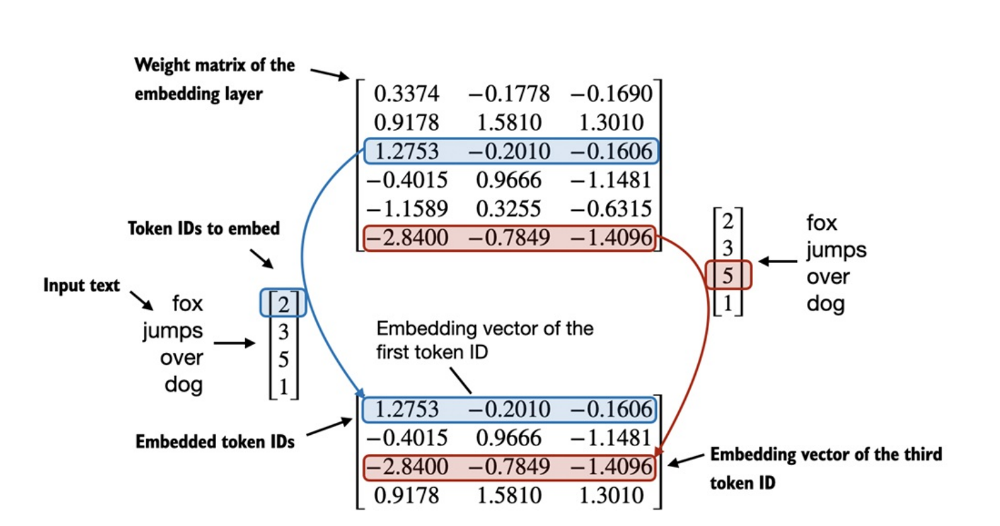

## Encoding Word Positions
- Ở phần trước ta đã xử lý xong từ `token` $\rightarrow$ `token embedding`. Tuy nhiên, LLM có 1 hạn chế là cơ chế `self-attention` (sẽ được tìm hiểu ở các phần sau) *"không có khái niệm về vị trí hay thứ tự của các token trong chuỗi"*.

- Cách mà `embedding layer` hoạt động là *cùng 1 token ID luôn được ánh xạ thành cùng 1 vector, bất kể xuất hiện ở vị trí nào*. Điều này được minh họa như sau:

    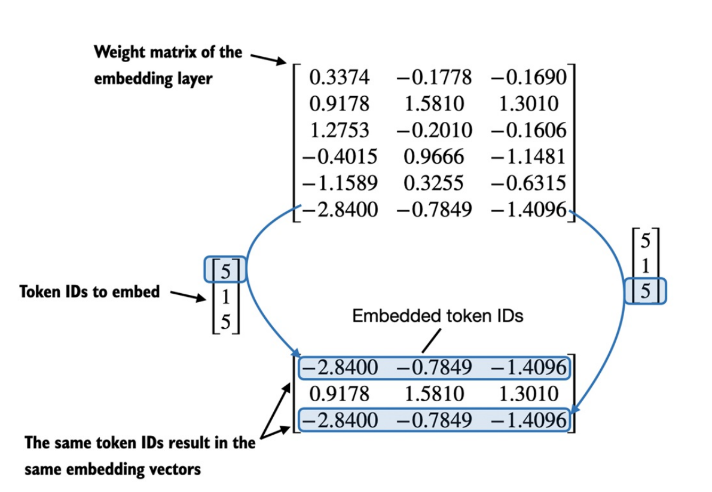

- Về nguyên tắc, `embedding layer` hoạt động có *tính nhất quán* như vậy sẽ giúp mô hình học ổn định, tuy nhiên mô hình sẽ *không nhận biết được vị trí* (`Hôm nay trời đẹp` & `Đẹp trời hôm nay` là 2 tập vector giống nhau). 

- Bên cạnh đó, cơ chế `self-attention` của LLM cũng *không nhận biết được vị trí*, nên việc bổ sung *thông tin vị trí* trước khi bắt đầu training là cần thiết.

- Ở đây chúng ta sẽ sử dụng `absolute positional embeddings (embedding vị trí tuyệt đối)`, thể hiện qua ảnh sau:

    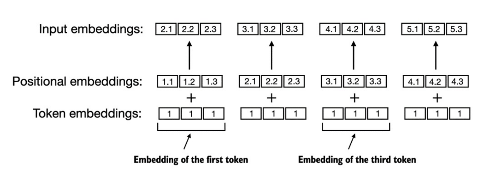

- Các mô hình `GPT` của `OpenAI` sử dụng `absolute positional embeddings` được tối ưu trong quá trình *training*, thay vì được định nghĩa sẵn như `positional encodings` trong Transformer gốc.
    + $\underline{Encoding} $: chuyển đổi từ dữ liệu *dạng này sang dạng khác*. Thường là quy tắc hoặc công thức toán học $\rightarrow$ cứng, cố định.

    + $\underline{Embedding}$: *continuous vector representation* $\rightarrow$ có thể tinh chỉnh tham số qua training.

- Code minh họa xem ở `5. Positional_embedding.ipynb`

- Tổng kết lại phần này có các bước như sau:
    
    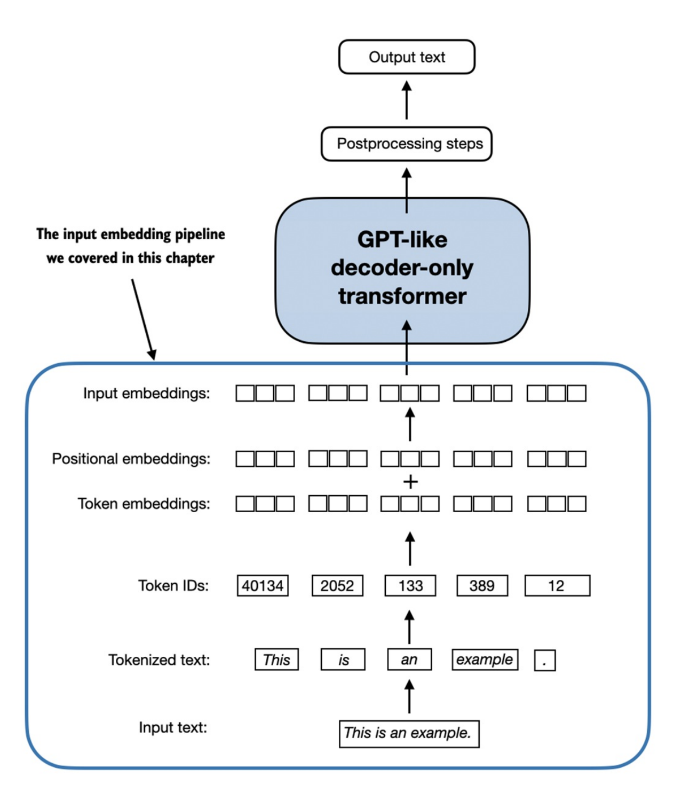

    + *Text → Token → Token ID → Token Embedding → add Positional Embedding → Input Embedding → LLM layers*