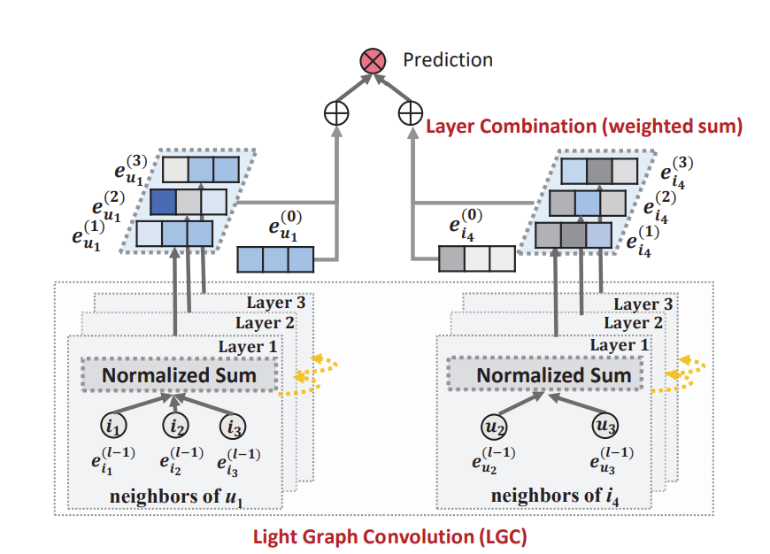

# Light Graph Convolutional Network

---

## Abstract
- Hai phương pháp phổ biến nhất của GCN - `biến đổi đặc trưng (feature transformation)` & `kích hoạt phi tuyến (nonlinear activation)` - đóng góp rất ít vào hiệu suất của lọc cộng tác.

- Bài báo đề xuất phương pháp `LightGCN`, chỉ bao gồm thành phần thiết yếu nhất trong GCN là `tổng hợp lân cận (neighborhood aggregation)` cho lọc cộng tác và bỏ qua 2 thành phần chính ở trên của GCN.

- Cụ thể, LightGCN học các embedding của user và item bằng cách lan truyền chúng một cách tuyến tính trên đồ thị tương tác user-item, và sử dụng tổng trọng số của các embedding học được ở tất cả các lớp làm embedding cuối cùng.

- Trung bình khoảng 16,0% cải thiện tương đối so với `Neural Graph Collaborative Filtering (NGCF)` - một mô hình dựa trên GCN.

## Preliminaries
- Ba biến thể đơn giản của NGCF được tạo ra: 
    + `NGCF-f` (loại bỏ biến đổi đặc trưng)
    + `NGCF-n` (loại bỏ kích hoạt phi tuyến)
    + `NGCF-fn` (loại bỏ cả hai)

- Từ kết quả, ta thấy được `biến đổi đặc trưng` và `kích hoạt phi tuyến` gây ảnh hưởng tiêu cực đến NGCF.

### NGCF Brief
- `Embedding ID ban đầu`: Ban đầu, mỗi người dùng và mặt hàng được khởi tạo bằng một embedding ID riêng biệt. $e_u^{(0)}$ biểu thị embedding ID của user u, và $e_i^{(0)}$ biểu thị embedding ID của item i.

- `Lan truyền embedding trên đồ thị`: 
$$
    \mathbf{e}_u^{(k+1)} = \sigma \left( \mathbf{W}_1 \mathbf{e}_u^{(k)} + \sum_{i \in \mathcal{N}_u} \frac{1}{\sqrt{|\mathcal{N}_u| |\mathcal{N}_i|}} \left( \mathbf{W}_1 \mathbf{e}_i^{(k)} + \mathbf{W}_2 \left( \mathbf{e}_i^{(k)} \odot \mathbf{e}_u^{(k)} \right) \right) \right),
$$
$$
    \mathbf{e}_i^{(k+1)} = \sigma \left( \mathbf{W}_1 \mathbf{e}_i^{(k)} + \sum_{u \in \mathcal{N}_i} \frac{1}{\sqrt{|\mathcal{N}_u| |\mathcal{N}_i|}} \left( \mathbf{W}_1 \mathbf{e}_u^{(k)} + \mathbf{W}_2 \left( \mathbf{e}_u^{(k)} \odot \mathbf{e}_i^{(k)} \right) \right) \right)
$$

    + $e_u^{(k)}$ và $e_i^{(k)}$ lần lượt là embedding của `user i` và `item i` sau `k lớp` lan truyền.
    + $\sigma$ là hàm kích hoạt phi tuyến
    + $N_u$ là tập hợp các item mà user u đã tương tác.
    + $N_i$ là tập hợp các user đã tương tác với item i.
    + $W1$ và $W2$ là các ma trận trọng số có thể huấn luyện để thực hiện biến đổi đặc trưng trong mỗi lớp.

- `Kết hợp các embedding`: Sau khi lan truyền qua L lớp, NGCF thu được L+1 embedding cho mỗi user và item. Các embedding này sau đó được kết hợp để tạo ra embedding cuối cùng cho từng user và item.

- `Dự đoán`: Mô hình sử dụng `tích trong` của các embedding cuối cùng của user và item để tạo ra điểm số dự đoán.

## Method
### LightGCN
- Ý tưởng cơ bản của `GCN`:
    + GCN học biểu diễn cho các nút bằng cách `làm mịn (smoothing)` các đặc trưng trên đồ thị. 
    + Quá trình này bao gồm việc lặp lại các phép tích chập đồ thị, nơi mà các đặc trưng của các nút lân cận được tập hợp lại để tạo thành biểu diễn mới cho nút mục tiêu. 
    + Phép tập hợp này thể hiện qua công thức:
    
    $$
        \mathbf{e}_u^{(k+1)} = \text{AGG}\left(\mathbf{e}_u^{(k)}, \{\mathbf{e}_i^{(k)} : i \in \mathcal{N}_u\}\right)
    $$
        + $e_u^{(k+1)}$ là biểu diễn của `node mục tiêu u` ở lớp thứ `k + 1`.
        + $e_u^{(k)}$ là biểu diễn của `node mục tiêu u` ở lớp thứ `k`.
        + $N_u$ là tập hợp các node `item` lân cận của node `u`.
        + $e_i^{(k)}$ là biểu diễn của `node i lân cận` ở lớp thứ `k`.
        + $AGG$ là hàm tập hợp cho phép tích chập đồ thị.

-  

    + `Light Graph Convolution (LGC)`: Đây là bước đầu tiên và cốt lõi của mô hình. Trong LGC, chỉ có phép tính `tổng chuẩn hóa (normalized sum)` của các embedding lân cận được thực hiện để tạo ra embedding ở lớp tiếp theo. Các phép toán như `tự kết nối (self-connection)`, `biến đổi đặc trưng (feature transformation)`, và `hàm kích hoạt phi tuyến (nonlinear activation)` đều bị loại bỏ, giúp đơn giản hóa GCN. 
    + `Layer Combination (tổng trọng số)`: Sau khi thực hiện LGC qua nhiều lớp, các embedding thu được ở mỗi lớp được kết hợp lại bằng cách tính tổng trọng số.

